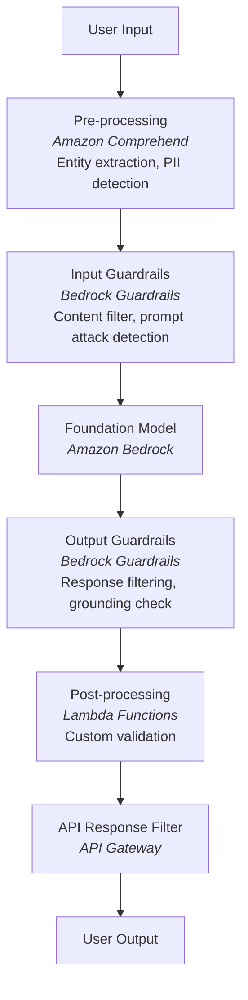

# Domain 3: AI Safety, Security & Governance (20%)

> Third largest domain. Know Guardrails deeply.

---

## Task 3.1: Input & Output Safety Controls

### Amazon Bedrock Guardrails - 6 Safeguard Policies

| Policy | What It Does |
|--------|-------------|
| **1. Content Moderation** | Filters harmful text/image content (hate, insults, sexual, violence, misconduct) |
| **2. Prompt Attack Detection** | Blocks prompt injection and jailbreak attempts |
| **3. Topic Classification** | Denies specified topics based on your policies |
| **4. PII Redaction** | Detects and masks personally identifiable information |
| **5. Contextual Grounding** | Validates responses against source material (anti-hallucination) |
| **6. Automated Reasoning** | Mathematical/logical verification of AI responses (99% accuracy) |

### Defense-in-Depth Architecture

### Hallucination Reduction
- **Bedrock Knowledge Bases** - ground responses in factual data
- **Confidence scoring** - quantify uncertainty
- **Semantic similarity search** - verify claims against sources
- **JSON Schema** - enforce structured outputs
- **Golden datasets** - detect hallucination drift

### Adversarial Threat Detection
- Prompt injection detection
- Jailbreak detection
- Input sanitization
- Safety classifiers
- Automated adversarial testing workflows

### Cross-Model Guardrails
- **ApplyGuardrail API** enables consistent safety across:
  - Bedrock models
  - Self-hosted models
  - Third-party models (OpenAI, Google Gemini)
  - Any agent framework

---

## Task 3.2: Data Security & Privacy Controls

### Network & Access Security

| Service | Purpose |
|---------|---------|
| **VPC endpoints** | Isolate FM network traffic |
| **IAM policies** | Enforce secure data access |
| **AWS Lake Formation** | Granular data access control |
| **AWS PrivateLink** | Private connectivity to Bedrock |
| **CloudWatch** | Monitor data access patterns |

### PII Protection

| Service | Capability |
|---------|------------|
| **Amazon Comprehend** | Detect PII in text |
| **Amazon Macie** | Detect PII in S3 data |
| **Bedrock Guardrails** | Redact PII in input/output |
| **Data masking** | Replace sensitive data with tokens |
| **Anonymization** | Remove identifying information |

### Data Retention & Lifecycle
- S3 Lifecycle configurations for data retention policies
- Bedrock native data privacy features (opt-out of model training)
- Encryption in transit and at rest (AWS KMS)

---

## Task 3.3: AI Governance & Compliance

### Compliance Frameworks

| Service | Governance Role |
|---------|-----------------|
| **SageMaker Model Cards** | Document model capabilities, limitations, intended use |
| **AWS Glue Data Catalog** | Register and catalog data sources |
| **AWS Glue** | Automatic data lineage tracking |
| **CloudWatch Logs** | Comprehensive decision logs |
| **CloudTrail** | Audit logging of all API calls |
| **Metadata tagging** | Source attribution in FM content |

### Data Lineage & Traceability
- Track data from source through processing to FM consumption
- AWS Glue Data Catalog for data source registration
- Metadata tagging for source attribution
- CloudTrail for complete audit trail

### Continuous Monitoring
- **Automated detection** for misuse, drift, and policy violations
- **Bias drift monitoring** - detect when model outputs become biased over time
- **Automated alerting** - CloudWatch alarms for anomalies
- **Token-level redaction** - fine-grained content control
- **Response logging** - capture all FM interactions
- **AI output policy filters** - enforce organizational policies

---

## Task 3.4: Responsible AI Principles

### Transparency
| Mechanism | Implementation |
|-----------|---------------|
| **Reasoning traces** | Bedrock agent tracing shows decision steps |
| **Confidence metrics** | CloudWatch collects uncertainty scores |
| **Source attribution** | Show evidence/citations for claims |
| **Explanations** | User-facing reasoning displays |

### Fairness & Bias
| Approach | Service |
|----------|---------|
| Fairness metrics | CloudWatch pre-defined metrics |
| A/B testing | Bedrock Prompt Flows for systematic testing |
| LLM-as-a-Judge | Bedrock automated model evaluations |
| Bias detection | SageMaker Clarify |

### Policy Compliance
- Bedrock Guardrails based on organizational policy
- **Model cards** document FM limitations and intended use
- Lambda functions for automated compliance checks
- Align with organizational, regulatory, and ethical requirements

---

## Security Services Quick Reference

| Category | Services |
|----------|----------|
| **Identity** | IAM, IAM Identity Center, Amazon Cognito |
| **Encryption** | AWS KMS, AWS Encryption SDK |
| **Network** | VPC, PrivateLink, VPC endpoints |
| **Data Protection** | Macie, Comprehend PII, Bedrock Guardrails |
| **Secrets** | AWS Secrets Manager |
| **Web Protection** | AWS WAF |
| **Audit** | CloudTrail, CloudWatch Logs |
| **Access Analysis** | IAM Access Analyzer |

---

## Key Takeaways for Domain 3

1. **Bedrock Guardrails**: Know all 6 policies (content mod, prompt attack, topics, PII, grounding, automated reasoning)
2. **Defense-in-depth**: Pre-processing -> Input guardrails -> FM -> Output guardrails -> Post-processing
3. **PII**: Comprehend detects, Macie scans S3, Guardrails redact in real-time
4. **Governance**: Model cards (SageMaker), data lineage (Glue), audit (CloudTrail)
5. **ApplyGuardrail API**: Works across ANY model, not just Bedrock
6. **Responsible AI**: Transparency (traces), Fairness (A/B testing), Accountability (model cards)
