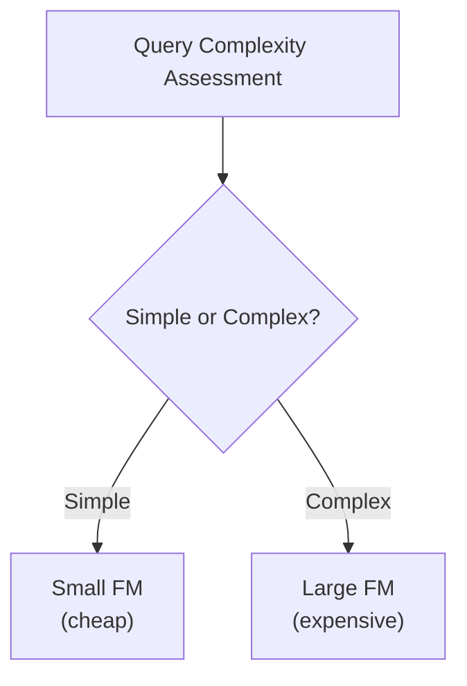

# Domain 4: Operational Efficiency & Optimization (12%)

> Smaller domain but easy points. Focus on cost optimization and monitoring.

---

## Task 4.1: Cost Optimization & Resource Efficiency

### Token Efficiency

| Technique | Description |
|-----------|-------------|
| **Token estimation** | Predict costs before running |
| **Context window optimization** | Use only necessary context |
| **Response size controls** | Limit max_tokens parameter |
| **Prompt compression** | Shorter prompts = fewer tokens = lower cost |
| **Context pruning** | Remove irrelevant context from RAG results |
| **Response limiting** | Constrain output length |

### Cost-Effective Model Selection

- **Tiered model usage** based on query complexity
- **Model cascading**: Try cheap model first, escalate if needed
- **Price-to-performance** ratio measurement
- **Intelligent Prompt Routing**: Can cut costs up to 30%
- **Model Distillation**: Runs up to 500% faster, costs 75% less

### Throughput Optimization
- **Batching strategies** - group requests
- **Capacity planning** - predict token processing needs
- **Auto-scaling** configurations for GenAI traffic
- **Provisioned throughput** for predictable workloads
- **Utilization monitoring** - avoid over-provisioning

### Caching Strategies

| Type | Description | Benefit |
|------|-------------|---------|
| **Semantic caching** | Cache similar (not identical) queries | Reduce redundant FM calls |
| **Prompt caching** | Cache common prompt prefixes | Reduce token costs |
| **Result fingerprinting** | Hash-based exact match cache | Instant repeat responses |
| **Edge caching** | CloudFront for static AI responses | Lower latency |
| **Deterministic hashing** | Hash request for cache key | Consistent cache hits |

---

## Task 4.2: Application Performance Optimization

### Latency Reduction

| Technique | Description |
|-----------|-------------|
| **Pre-computation** | Cache answers for predictable queries |
| **Latency-optimized models** | Bedrock models tuned for speed |
| **Parallel requests** | Run independent FM calls concurrently |
| **Response streaming** | Show partial results immediately |
| **Performance benchmarking** | Measure and compare approaches |

### Retrieval Performance
- **Index optimization** - tune vector database indices
- **Query preprocessing** - clean/expand queries before search
- **Hybrid search** with custom scoring (keyword + vector)
- **Reranking** - re-order results by relevance

### FM Parameter Tuning

| Parameter | Effect |
|-----------|--------|
| **Temperature** | 0 = deterministic, 1 = creative |
| **Top-k** | Limit vocabulary choices |
| **Top-p** | Nucleus sampling threshold |
| **Max tokens** | Control response length |

- A/B test parameter configurations
- Different settings for different use cases
- Lower temperature for factual tasks, higher for creative

### Resource Allocation
- Capacity planning for **token processing requirements**
- Monitor **prompt and completion patterns**
- Auto-scaling optimized for **GenAI traffic patterns** (bursty)
- API call profiling for prompt-completion patterns

### System-Level Optimization
- Vector database query optimization
- Latency reduction for LLM inference
- Efficient service communication patterns
- Batch inference for non-real-time workloads

---

## Task 4.3: Monitoring Systems

### GenAI-Specific Metrics to Track

| Metric | Service | Why |
|--------|---------|-----|
| **Token usage** | CloudWatch | Cost tracking |
| **Prompt effectiveness** | CloudWatch | Quality monitoring |
| **Hallucination rate** | CloudWatch + golden datasets | Accuracy |
| **Response quality** | CloudWatch | User satisfaction |
| **Latency** | CloudWatch + X-Ray | Performance |
| **Cost anomalies** | Cost Anomaly Detection | Budget protection |
| **Response drift** | Anomaly detection | Model degradation |

### Bedrock Model Invocation Logs
- Detailed request and response analysis
- Token usage per request
- Latency per invocation
- Error rates and types

### Observability Stack

| Layer | Service | Purpose |
|-------|---------|---------|
| **Metrics** | CloudWatch | Dashboards, alarms, anomaly detection |
| **Logs** | CloudWatch Logs | Request/response logging |
| **Traces** | AWS X-Ray | End-to-end request tracing |
| **Dashboards** | Managed Grafana | Custom visualizations |
| **Cost** | Cost Explorer, Cost Anomaly Detection | Spend tracking |

### What to Monitor

#### Operational Metrics
- API latency, error rates, throughput
- Token consumption rates
- Model invocation counts

#### Business Impact Metrics
- User satisfaction scores
- Task completion rates
- Cost per interaction

#### Agent & Tool Monitoring
- Tool call patterns and frequency
- Tool performance metrics
- Multi-agent coordination tracking
- Usage baselines for anomaly detection

#### Vector Store Monitoring
- Query performance
- Index health
- Data quality validation
- Automated index optimization

### Troubleshooting Frameworks
- **Golden datasets** to detect hallucinations
- **Output diffing** for response consistency
- **Reasoning path tracing** for logical errors
- Specialized observability pipelines

---

## Key Takeaways for Domain 4

1. **Token efficiency** = cost savings: compress prompts, limit responses, prune context
2. **Model cascading**: Route simple queries to cheap models, complex to expensive
3. **Caching**: Semantic caching, prompt caching, edge caching
4. **Streaming**: Always stream for better UX in chat applications
5. **Monitor everything**: Token usage, hallucination rates, cost anomalies, latency
6. **Bedrock Invocation Logs**: Enable for detailed request/response analysis
7. **Temperature/top-k/top-p**: Know when to use what settings
