# Complete Guide to AWS GenAI Services

> Every AWS GenAI/AI/ML service on the AIP-C01 exam: what it does, how it's used, and when to pick one over another.

---

## TABLE OF CONTENTS

1. [Amazon Bedrock (Platform)](#1-amazon-bedrock---the-genai-platform)
2. [Bedrock Knowledge Bases (RAG)](#2-amazon-bedrock-knowledge-bases)
3. [Bedrock Guardrails (Safety)](#3-amazon-bedrock-guardrails)
4. [Bedrock Agents (Autonomous AI)](#4-amazon-bedrock-agents)
5. [Bedrock AgentCore (Agent Infrastructure)](#5-amazon-bedrock-agentcore)
6. [Strands Agents (Open-Source SDK)](#5b-strands-agents-open-source-sdk)
7. [AWS Agent Squad (Multi-Agent Framework)](#5c-aws-agent-squad-multi-agent-framework)
8. [Bedrock Prompt Management](#6-amazon-bedrock-prompt-management)
7. [Bedrock Prompt Flows](#7-amazon-bedrock-prompt-flows)
8. [Bedrock Model Evaluation](#8-amazon-bedrock-model-evaluation)
9. [Bedrock Data Automation](#9-amazon-bedrock-data-automation)
10. [Amazon Titan](#10-amazon-titan)
11. [Amazon SageMaker AI](#11-amazon-sagemaker-ai)
12. [Amazon Q Developer](#12-amazon-q-developer)
13. [Amazon Q Business](#13-amazon-q-business)
14. [Amazon Comprehend](#14-amazon-comprehend)
15. [Amazon Kendra](#15-amazon-kendra)
16. [Amazon OpenSearch Service](#16-amazon-opensearch-service)
17. [Amazon Lex](#17-amazon-lex)
18. [Amazon Textract](#18-amazon-textract)
19. [Amazon Rekognition](#19-amazon-rekognition)
20. [Amazon Transcribe](#20-amazon-transcribe)
21. [Amazon Augmented AI (A2I)](#21-amazon-augmented-ai-a2i)
22. [Amazon Connect](#22-amazon-connect)
23. [Comparison Tables](#comparison-tables)

---

## 1. Amazon Bedrock - The GenAI Platform

### What It Is
A **fully managed service** providing API access to 100+ foundation models (FMs) from Amazon, Anthropic, Meta, Cohere, Mistral, AI21 Labs, Stability AI, and others. It's the central platform for building GenAI apps on AWS.

### How It's Used
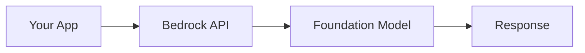

### Key APIs

| API | Type | When to Use |
|-----|------|-------------|
| **Converse API** | AWS SDK, unified format | New apps, multi-turn chat (RECOMMENDED) |
| **Invoke API** | AWS SDK, model-specific format | Direct model calls, model-specific features |
| **converse_stream()** | AWS SDK, streaming | Chat UIs needing real-time token output |
| **invoke_model_with_response_stream()** | AWS SDK, streaming | Streaming with model-specific format |
| **Chat Completions API** | OpenAI-compatible | Migrating from OpenAI |
| **Responses API** | OpenAI-compatible | OpenAI SDK drop-in replacement |

### Pricing Models

| Model | Best For | How It Works |
|-------|----------|-------------|
| **On-demand** | Variable/unpredictable traffic | Pay per input/output token |
| **Provisioned Throughput** | Predictable high-volume | Reserved capacity, consistent performance |
| **Batch Inference** | Non-real-time bulk jobs | Up to 50% cheaper, async processing |

### Key Features at a Glance
- **Cross-Region Inference** - automatic failover across regions for resilience
- **Intelligent Prompt Routing** - auto-routes to cheapest capable model (saves ~30%)
- **Model Distillation** - train smaller model from larger (500% faster, 75% cheaper)
- **Prompt Caching** - reuse common prompt prefixes to reduce cost
- **Data Privacy** - your data is NEVER used to train Bedrock models

### When to Use Bedrock
- You want to USE foundation models (not train from scratch)
- You need managed infrastructure with no ML ops
- You want access to multiple model providers
- You need enterprise security (VPC, IAM, encryption, compliance)

---

## 2. Amazon Bedrock Knowledge Bases

### What It Is
A **fully managed RAG (Retrieval Augmented Generation) service**. It ingests your documents, chunks them, creates embeddings, stores them in a vector database, and lets FMs query that data for grounded responses.

### How It's Used
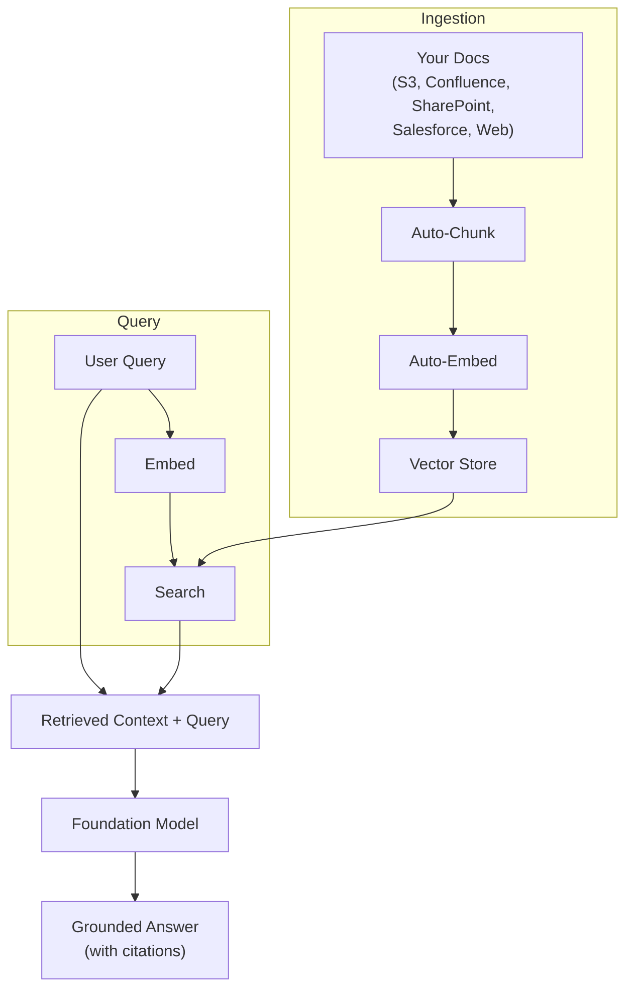

### Data Sources Supported
- Amazon S3 (files: PDF, TXT, HTML, MD, DOC, CSV)
- Confluence, Salesforce, SharePoint
- Web Crawler (preview)
- Custom/programmatic ingestion
- Structured data (SQL databases, data warehouses)

### Vector Stores Supported

| Vector Store | Type | Notes |
|-------------|------|-------|
| OpenSearch Serverless | Managed (default) | Auto-scaling, zero config |
| Amazon Aurora (pgvector) | SQL-compatible | If you already use Aurora |
| Amazon Neptune Analytics | Graph | GraphRAG with relationships |
| MongoDB Atlas | Third-party | Existing MongoDB users |
| Pinecone | Third-party | Popular vector DB |
| Redis Enterprise Cloud | Third-party | In-memory speed |

### Chunking Strategies

| Strategy | Description | Best For |
|----------|-------------|----------|
| **Fixed-size** | Every N tokens | Simple uniform docs |
| **Semantic** | By meaning boundaries | Mixed content types |
| **Hierarchical** | Parent-child structure | Long structured docs |
| **Custom (Lambda)** | Your own logic | Special requirements |

### Key APIs

| API | What It Does |
|-----|-------------|
| `Retrieve` | Returns relevant chunks (you build the prompt yourself) |
| `RetrieveAndGenerate` | End-to-end RAG (retrieval + FM generates answer) |

### Advanced Features
- **Reranking models** - re-order results for better relevance
- **Multimodal parsing** - extracts from tables, figures, charts
- **Source attribution** - citations showing where info came from
- **GraphRAG** - Neptune Analytics creates relationship graphs for better retrieval
- **Natural language to SQL** - query structured databases conversationally

### When to Use Knowledge Bases
- You want RAG without building custom pipelines
- You need managed chunking, embedding, and indexing
- You want source citations in responses
- You connect to S3, Confluence, SharePoint, Salesforce, or web content

---

## 3. Amazon Bedrock Guardrails

### What It Is
A safety layer that filters harmful content, redacts PII, detects hallucinations, and blocks prompt attacks. Applies to inputs AND outputs of any FM.

### The 6 Safeguard Policies

| # | Policy | What It Does | Example |
|---|--------|-------------|---------|
| 1 | **Content Moderation** | Filters hate, insults, sexual, violence, misconduct | Block toxic user messages |
| 2 | **Prompt Attack Detection** | Detects prompt injection & jailbreak attempts | Block "ignore all previous instructions" |
| 3 | **Denied Topics** | Blocks responses on specified topics | Refuse to discuss competitors |
| 4 | **PII Redaction** | Detects & masks PII (name, email, SSN, etc.) | Mask credit card numbers in output |
| 5 | **Contextual Grounding** | Validates response against source docs | Flag answers not supported by RAG context |
| 6 | **Automated Reasoning** | Mathematical/logical verification | Verify pricing calculations are correct |

### How It's Used
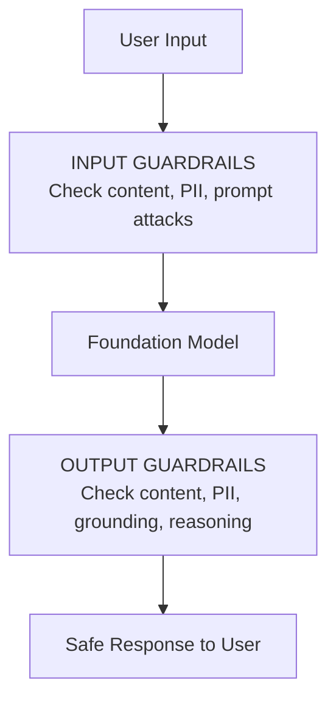

### Cross-Model Support (ApplyGuardrail API)
```python
# Works with ANY model - not just Bedrock!
response = bedrock.apply_guardrail(
    guardrailIdentifier='my-guardrail',
    guardrailVersion='1',
    source='OUTPUT',
    content=[{'text': {'text': model_response}}]
)
```
- Bedrock models, self-hosted models, OpenAI, Google Gemini, etc.
- One guardrail config protects your entire AI stack

### When to Use Guardrails
- ANY production GenAI application
- Regulated industries (finance, healthcare)
- Public-facing chatbots
- When you need PII protection
- When accuracy/hallucination prevention is critical

---

## 4. Amazon Bedrock Agents

### What It Is
A **guided, console-based agent builder** within Bedrock. You select a model, write instructions, define actions, and Bedrock orchestrates everything.

### How It Works
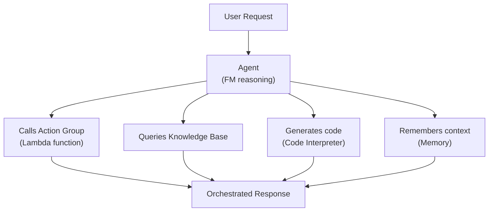

### Components

| Component | What It Is |
|-----------|-----------|
| **Foundation Model** | The "brain" - reasons about what to do |
| **Instructions** | System prompt defining agent behavior |
| **Action Groups** | Lambda functions the agent can invoke |
| **Knowledge Bases** | Data sources the agent can search |
| **Memory** | Retains context across conversations |
| **Code Interpreter** | Executes code for analysis/visualization |

### Key Capabilities
- **Multi-agent collaboration** - supervisor agent coordinates specialized agents
- **RAG integration** - agents can query Knowledge Bases
- **Automated orchestration** - FM decides which tools to use and in what order
- **Session memory** - remembers previous interactions

### When to Use Bedrock Agents
- You want a guided, low-code agent building experience
- Your agents primarily use Bedrock models
- You need quick prototyping of agent workflows
- Your tools are Lambda functions

---

## 5. Amazon Bedrock AgentCore

### What It Is
An **enterprise-grade infrastructure platform** for deploying and operating AI agents at scale. Works with ANY framework and ANY model.

### How It Differs from Bedrock Agents

| Feature | Bedrock Agents | Bedrock AgentCore |
|---------|---------------|-------------------|
| **Builder experience** | Guided console, low-code | Bring your own code/framework |
| **Framework support** | Bedrock-native only | ANY (Strands, LangChain, CrewAI, custom) |
| **Model support** | Bedrock models | Any model (Bedrock, self-hosted, third-party) |
| **Target user** | Developers building on Bedrock | Teams deploying agents at enterprise scale |
| **Infrastructure** | Managed by Bedrock | Full infra management with isolation |
| **Best for** | Prototyping, simple agents | Production, complex multi-agent systems |

### AgentCore Services

#### Build Services
| Service | Purpose |
|---------|---------|
| **Memory** | Persistent memory across sessions, learns from interactions |
| **Gateway** | Converts APIs/Lambda into agent-compatible tools, semantic tool discovery |
| **Secure Browser** | Execute web-based workflows safely |
| **Code Interpreter** | Run code securely (data viz, analysis) |
| **Policy Engine** | Natural language policies -> Cedar enforcement rules |

#### Deploy Services
| Service | Purpose |
|---------|---------|
| **Serverless Runtime** | Session isolation, workloads up to 8 hours |
| **Identity & Access** | Native identity provider integration |
| **VPC + PrivateLink** | Enterprise-grade network security |
| **Flexible Deployment** | Code upload or container-based |

#### Monitor Services
| Service | Purpose |
|---------|---------|
| **CloudWatch Dashboards** | Token usage, latency, error rates |
| **Quality Evaluation** | Correctness, helpfulness, safety, goal success |
| **OpenTelemetry** | Integration with observability tools |
| **Audit Trails** | Complete decision logging |

### When to Use AgentCore
- You use open-source frameworks (Strands, LangChain, CrewAI)
- You need multi-framework agent deployments
- You need enterprise-grade isolation and security
- You're running complex, long-running agent workflows (up to 8 hours)
- You want to avoid managing infrastructure

---

## 5b. Strands Agents (Open-Source SDK)

### What It Is
An **open-source Python SDK** from AWS for building AI agents in just a few lines of code. It takes a **model-driven approach** - you give the agent a model, tools, and a prompt, and the built-in agent loop handles reasoning, tool calling, and orchestration automatically. Apache 2.0 licensed.

### How It Works

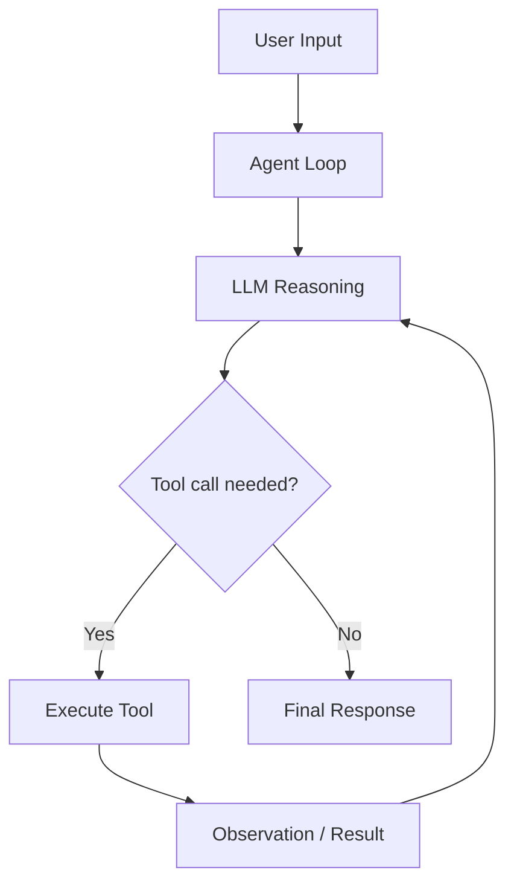

**The Agent Loop:**
1. User sends input to agent
2. Agent sends prompt + tools to LLM
3. LLM reasons and decides: call a tool or respond
4. If tool call -> execute tool, feed result back to LLM
5. LLM reasons again with tool result
6. Repeat until LLM decides it has enough info
7. Return final response

### Installation & Quick Start

```python
pip install strands-agents strands-agents-tools

from strands import Agent
from strands_tools import calculator

agent = Agent(tools=[calculator])
agent("What is the square root of 1764?")
```

**Requirements:** Python 3.10+. Default: AWS Bedrock with Claude Sonnet.

### Key Features

| Feature | Description |
|---------|------------|
| **Model-driven** | LLM decides what to do - no hardcoded workflows |
| **13+ model providers** | Bedrock, Anthropic, OpenAI, Google, Ollama, Mistral, Cohere, SageMaker, etc. |
| **@tool decorator** | Define tools as simple Python functions |
| **Native MCP support** | Connect to any MCP server for thousands of pre-built tools |
| **Streaming** | Real-time token-by-token output |
| **Hot-reloading** | Auto-discover tools from `./tools/` directory |
| **Bidirectional streaming** | Voice/audio agents (experimental - Nova Sonic, Gemini Live) |
| **Model-agnostic** | No vendor lock-in, swap providers freely |

### Custom Tools

```python
from strands import Agent, tool

@tool
def get_weather(city: str) -> str:
    """Get current weather for a city."""
    return f"Weather in {city}: 72F, sunny"

agent = Agent(tools=[get_weather])
agent("What's the weather in Seattle?")
```

- Docstrings become tool descriptions for the LLM automatically
- Type hints define the tool's input schema

### MCP Integration

```python
from strands.tools.mcp import MCPClient
from mcp import stdio_client, StdioServerParameters

client = MCPClient(
    lambda: stdio_client(StdioServerParameters(
        command="uvx",
        args=["awslabs.aws-documentation-mcp-server@latest"]
    ))
)

with client:
    agent = Agent(tools=client.list_tools_sync())
    agent("How do I create a Bedrock Knowledge Base?")
```

### Switching Model Providers

```python
from strands.models import BedrockModel

# Use a different Bedrock model
model = BedrockModel(model_id="us.amazon.nova-pro-v1:0", temperature=0.3)
agent = Agent(model=model, tools=[get_weather])
```

### When to Use Strands Agents
- You want full control over agent code (open-source)
- You need model-agnostic agents (swap between Bedrock, OpenAI, local models)
- You want Python-first development with `@tool` decorator simplicity
- You need MCP server integration for extensible tool access
- You plan to deploy on AgentCore for production scale

---

## 5c. AWS Agent Squad (Multi-Agent Framework)

### What It Is
An **open-source framework** (Python + TypeScript) for orchestrating **multiple specialized AI agents** that collaborate to handle complex conversations. Formerly called "Multi-Agent Orchestrator."

### How It Works

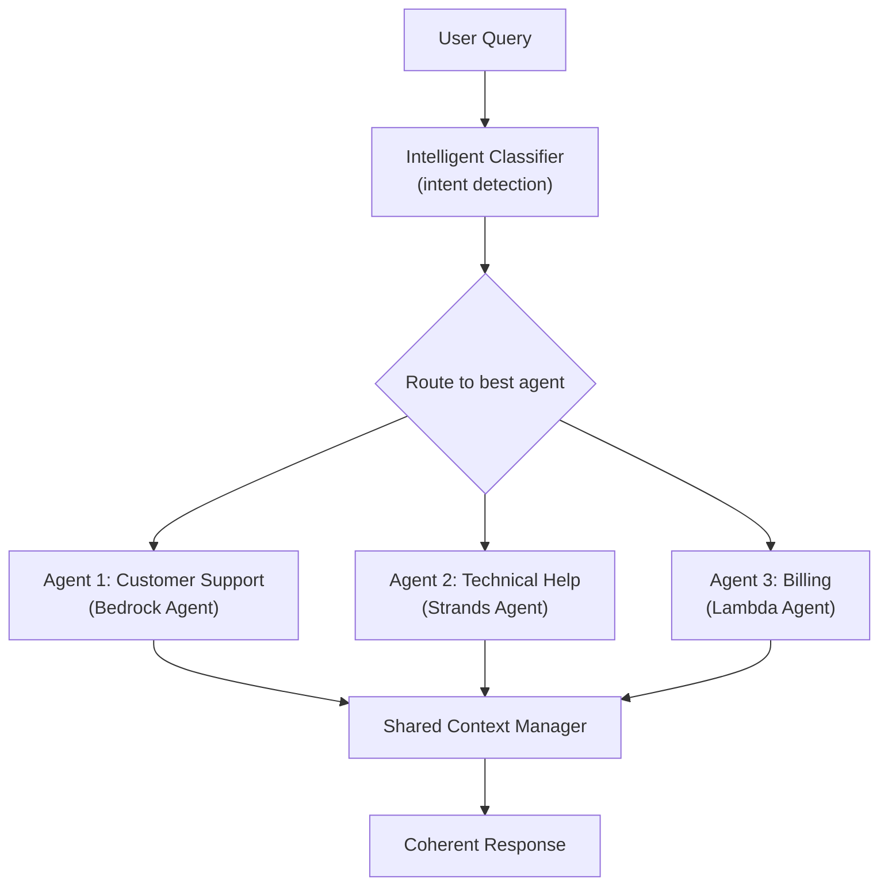

### Key Features

| Feature | Description |
|---------|------------|
| **Intelligent routing** | Auto-classifies user intent and routes to best agent |
| **Context management** | Maintains conversation context across agents |
| **Built-in agent types** | Bedrock Agent, Lex Bot, Lambda, Comprehend, LLM-based |
| **Streaming + non-streaming** | Flexible response modes |
| **Universal deployment** | Lambda, local, any cloud platform |
| **Python + TypeScript** | Dual language support |

### Built-in Agent Types
- **Bedrock Agent** - connects to Amazon Bedrock Agents
- **Lex Bot Agent** - wraps Amazon Lex bots
- **Lambda Agent** - invokes Lambda functions
- **Comprehend Agent** - text analysis and filtering
- **LLM Agent** - direct LLM-powered reasoning
- **Custom agents** - bring your own implementation

### When to Use Agent Squad
- You need **multiple specialized agents** collaborating
- You want automatic **intent-based routing** to the right agent
- You need **conversation context** shared across agents
- You're building a **unified AI assistant** with diverse capabilities

---

### Strands Agents vs Agent Squad vs Bedrock Agents vs AgentCore

| Feature | Strands Agents | Agent Squad | Bedrock Agents | Bedrock AgentCore |
|---------|---------------|-------------|----------------|-------------------|
| **Type** | Open-source SDK | Open-source framework | Managed service | Managed infrastructure |
| **Focus** | Single agent, model-driven | Multi-agent orchestration | Guided agent builder | Enterprise agent deployment |
| **Language** | Python | Python + TypeScript | Console / SDK | Any framework |
| **Model support** | 13+ providers | Any LLM | Bedrock models | Any model |
| **Tool system** | @tool decorator + MCP | Agent-as-tool | Action Groups (Lambda) | Gateway + MCP |
| **Multi-agent** | Agent-as-tool pattern | Native (classifier + routing) | Supervisor pattern | Any pattern |
| **Infrastructure** | Self-managed or AgentCore | Self-managed | Fully managed | Fully managed |
| **Code needed** | Medium (Python) | Medium (Python/TS) | Low (console) | Medium (bring code) |
| **Best for** | Custom agents, rapid dev | Multi-agent routing | Quick start, simple agents | Production at scale |

### When to Use Which?

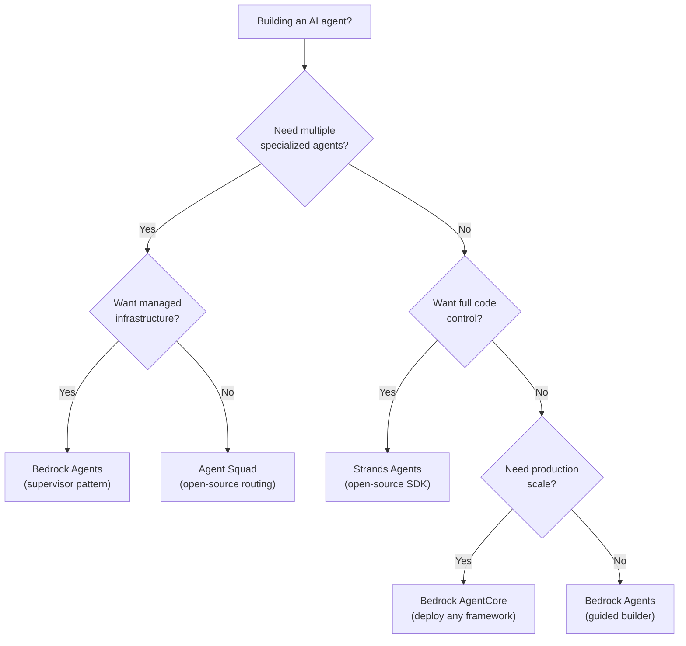

### Common Combination: Strands + AgentCore
The typical production pattern:
1. **Develop** agents locally with **Strands Agents** (fast iteration, @tool decorator)
2. **Deploy** to production on **AgentCore** (managed infra, security, monitoring)
3. Optionally coordinate multiple Strands agents via **Agent Squad**

---

## 6. Amazon Bedrock Prompt Management

### What It Is
A service to **create, version, and govern prompt templates** with variables and approval workflows.

### How It's Used
```python
# Create a parameterized template
template = """
You are a {role}. Answer the user's question about {topic}.
Context: {context}
Question: {question}
"""
# Version it, approve it, deploy it
```

### Features

| Feature | Description |
|---------|------------|
| **Parameterized templates** | Variables like {topic}, {context} |
| **Versioning** | Track changes over time, rollback |
| **Approval workflows** | Review before deploying prompts |
| **Audit trail** | CloudTrail logs who changed what |

### When to Use Prompt Management
- Multiple teams share prompts
- You need governance/approval before prompt changes go live
- You want prompt versioning and rollback
- Compliance requires audit trails of prompt changes

---

## 7. Amazon Bedrock Prompt Flows

### What It Is
A **visual, no-code workflow builder** for chaining multiple FM calls, conditions, and data sources into multi-step AI workflows.

### How It's Used
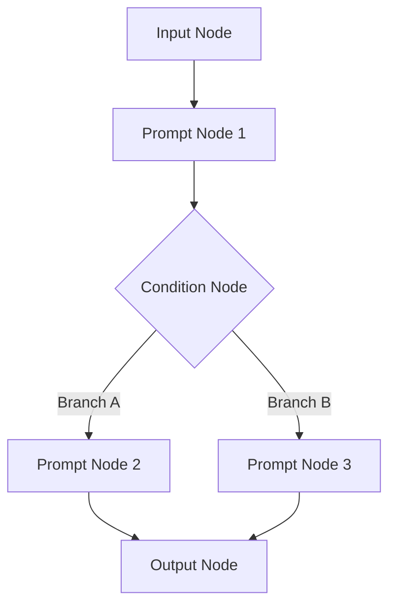

### Capabilities
- Sequential prompt chains
- Conditional branching (if/else based on FM output)
- Parallel execution paths
- Integration with Knowledge Bases
- Pre/post-processing steps
- Reusable components

### Prompt Management vs Prompt Flows

| Feature | Prompt Management | Prompt Flows |
|---------|------------------|-------------|
| **Purpose** | Manage individual prompt templates | Orchestrate multi-step prompt workflows |
| **Interface** | Template editor | Visual drag-and-drop builder |
| **Scope** | Single prompt | Chain of prompts + logic + data |
| **Use case** | Version/govern one prompt | Build complex AI pipelines |
| **Analogy** | Managing a single SQL query | Building an ETL pipeline |

### When to Use Prompt Flows
- Multi-step AI workflows (classify -> extract -> summarize)
- Non-technical users building AI pipelines
- Conditional logic based on FM outputs
- Rapid prototyping of complex prompt chains

---

## 8. Amazon Bedrock Model Evaluation

### What It Is
Built-in tools to **compare and evaluate foundation models** on your specific data and use cases.

### How It's Used
- Upload test datasets
- Run evaluations across multiple models
- Compare accuracy, latency, cost, relevance
- Use automated metrics OR human evaluation OR LLM-as-a-Judge

### Evaluation Types

| Type | Method | Best For |
|------|--------|----------|
| **Automatic** | Automated metrics (ROUGE, BERTScore) | Quick comparisons |
| **Human** | Human reviewers rate outputs | Subjective quality |
| **LLM-as-a-Judge** | FM evaluates other FM outputs | Scalable quality assessment |

### Agent Evaluations
- Task completion rate
- Tool usage effectiveness
- Reasoning quality in multi-step workflows

### When to Use Model Evaluation
- Choosing between multiple FMs for a use case
- Validating model changes before deployment
- Ongoing quality monitoring
- A/B testing model configurations

---

## 9. Amazon Bedrock Data Automation

### What It Is
A service that **automatically processes and extracts structured data** from unstructured documents, images, audio, and video using foundation models.

### How It's Used
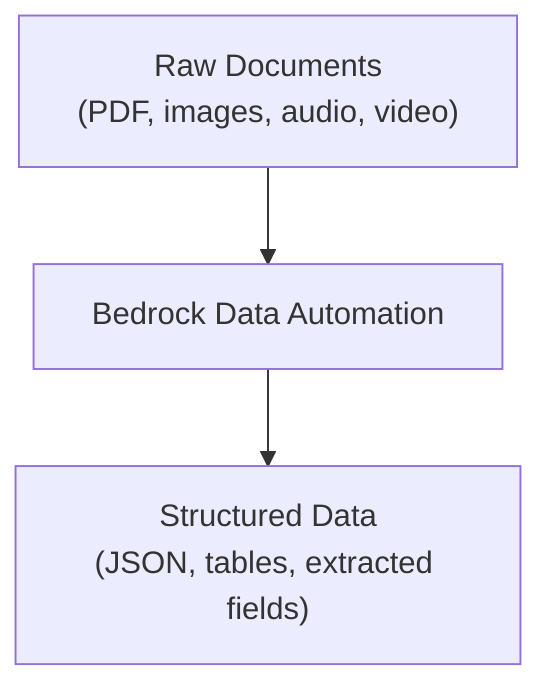

### Capabilities
- Document understanding and extraction
- Multi-modal data processing
- Automated workflow creation
- Integration with Bedrock Knowledge Bases

### When to Use Data Automation
- Processing large volumes of unstructured documents
- Extracting structured data from multi-modal inputs
- Automating data preparation for AI workflows

---

## 10. Amazon Titan

### What It Is
Amazon's **own family of foundation models** available through Bedrock.

### Model Types

| Model | Purpose | Key Feature |
|-------|---------|-------------|
| **Titan Text** | Text generation, summarization, Q&A | General-purpose text FM |
| **Titan Embeddings** | Convert text to vector embeddings | For RAG/semantic search |
| **Titan Image Generator** | Create and edit images | Text-to-image generation |
| **Titan Multimodal Embeddings** | Embed text + images together | Multi-modal search |

### When to Use Titan
- **Titan Embeddings** - default choice for RAG embedding in Knowledge Bases
- **Titan Text** - when you want an AWS-native model
- **Titan Image** - image generation without third-party providers
- Cost-effective alternative to larger third-party models

---

## 11. Amazon SageMaker AI

### What It Is
A **comprehensive ML platform** for building, training, fine-tuning, and deploying ML/AI models. Much broader than Bedrock - covers the entire ML lifecycle.

### Key Sub-Services

| Service | What It Does | Exam Relevance |
|---------|-------------|----------------|
| **SageMaker Endpoints** | Host custom/fine-tuned models for inference | Deploy models not on Bedrock |
| **Model Registry** | Version, catalog, manage model artifacts | MLOps lifecycle |
| **Model Cards** | Document model capabilities, limitations, intended use | Compliance & governance |
| **Model Monitor** | Detect data drift, bias drift in production | Ongoing quality monitoring |
| **Clarify** | Detect bias, explain model predictions | Responsible AI / fairness |
| **Data Wrangler** | Visual data preparation & transformation | Data quality for FM input |
| **Ground Truth** | Human data labeling at scale | Training data creation |
| **JumpStart** | Pre-trained model hub (deploy in 1 click) | Quick model deployment |
| **Processing** | Run data processing jobs | ETL for ML data |
| **Neo** | Optimize models for edge/specific hardware | Model optimization |
| **Unified Studio** | Integrated IDE for analytics + AI | Development environment |

### SageMaker vs Bedrock

| Feature | Amazon Bedrock | Amazon SageMaker |
|---------|---------------|-----------------|
| **Primary purpose** | USE foundation models via API | BUILD, TRAIN, and deploy any ML model |
| **Model access** | 100+ pre-built FMs, API-only | Any model (custom, open-source, pre-built) |
| **Fine-tuning** | Limited (Bedrock custom models) | Full fine-tuning (LoRA, full, adapters) |
| **Training** | No training from scratch | Full training capabilities |
| **Infrastructure** | Fully managed, serverless | You manage instances (but tools help) |
| **ML expertise needed** | Low - prompt engineering focus | Medium to High - ML engineering |
| **Deployment** | Bedrock handles it | You configure endpoints |
| **Best for** | GenAI apps using existing FMs | Custom models, fine-tuning, MLOps |

### When to Use SageMaker
- Fine-tuning models with LoRA/adapters
- Deploying custom models not available on Bedrock
- Full ML lifecycle management (train -> deploy -> monitor)
- Bias detection and explainability (Clarify)
- Model documentation for compliance (Model Cards)
- Data preparation and labeling (Data Wrangler, Ground Truth)

---

## 12. Amazon Q Developer

### What It Is
An **AI-powered coding assistant** for software developers. Integrated into IDEs (VS Code, JetBrains, etc.) and the AWS Console.

### Capabilities

| Feature | What It Does |
|---------|-------------|
| **Code generation** | Write code from natural language descriptions |
| **Code completion** | Inline suggestions as you type |
| **Code review** | Automated review of code quality |
| **Debugging** | Identify and fix bugs |
| **Refactoring** | Improve code structure |
| **Test generation** | Write unit tests |
| **Security scanning** | Find vulnerabilities in code |
| **Code transformation** | Upgrade Java versions, .NET to Linux |
| **AWS expertise** | Best practices, architecture guidance |
| **Cost optimization** | Identify AWS cost savings |
| **Incident investigation** | Diagnose operational issues |

### Where It Works
- VS Code, JetBrains, Visual Studio, Eclipse
- AWS Management Console
- Command line (CLI)
- Slack, Microsoft Teams

### When to Use Q Developer
- Writing and reviewing code for GenAI applications
- Debugging FM API integration issues
- Getting AWS architecture recommendations
- Security scanning GenAI application code
- Upgrading/transforming application code

---

## 13. Amazon Q Business

### What It Is
An **enterprise AI assistant** that answers questions using your company's internal data. Think "ChatGPT for your company's knowledge."

### Capabilities

| Feature | What It Does |
|---------|-------------|
| **Enterprise search** | Search across all connected data sources |
| **Q&A with citations** | Answer questions with source references |
| **Content generation** | Draft emails, summaries, reports |
| **Q Apps** | Build lightweight apps from prompts |
| **Cross-app actions** | 50+ actions across Jira, Salesforce, ServiceNow, PagerDuty |
| **Workflow automation** | Automate business processes |

### Data Sources
- Documents (S3, SharePoint, Confluence)
- Databases and data warehouses
- SaaS applications (Salesforce, Jira, ServiceNow)
- Email systems
- Internal wikis

### Q Developer vs Q Business

| Feature | Q Developer | Q Business |
|---------|------------|------------|
| **Target user** | Software developers | Business/knowledge workers |
| **Primary purpose** | Code generation, debugging, AWS help | Enterprise knowledge search, Q&A |
| **Data sources** | Codebase, AWS documentation | Company docs, SaaS apps, databases |
| **Where it works** | IDEs, CLI, AWS Console | Web UI, Slack, Teams |
| **Output** | Code, architecture advice, debugging | Answers, summaries, reports, app actions |
| **Use case** | Building GenAI apps | Using GenAI for business productivity |

### When to Use Q Business
- Enterprise knowledge management
- Internal search across multiple data sources
- Employee self-service Q&A
- Automating business workflows
- Content generation for business users

---

## 14. Amazon Comprehend

### What It Is
A **Natural Language Processing (NLP) service** that extracts insights from text. Pre-trained - no ML expertise required.

### Capabilities

| Feature | What It Does | Example |
|---------|-------------|---------|
| **PII Detection** | Find personally identifiable information | Detect SSN, email, phone in text |
| **PII Redaction** | Mask/remove PII from text | Replace "John Smith" with "[NAME]" |
| **Entity Recognition** | Extract named entities | People, places, organizations, dates |
| **Sentiment Analysis** | Detect positive/negative/neutral/mixed | Customer review analysis |
| **Key Phrase Extraction** | Identify important phrases | Document summarization prep |
| **Language Detection** | Identify text language | Route to correct processing |
| **Topic Modeling** | Discover topics in document collections | Categorize support tickets |
| **Custom Classification** | Train custom text classifiers | Domain-specific categorization |
| **Syntax Analysis** | Parse parts of speech | Linguistic analysis |

### Comprehend vs Bedrock Guardrails (for PII)

| Feature | Comprehend | Bedrock Guardrails |
|---------|-----------|-------------------|
| **PII detection** | Yes - standalone NLP analysis | Yes - as part of guardrail policy |
| **PII redaction** | Yes - detect and mask | Yes - detect, mask, or block |
| **Scope** | Any text (not tied to FM pipeline) | Input/output of FM interactions |
| **Integration** | Standalone API, pre-processing | Built into Bedrock inference flow |
| **Additional features** | Sentiment, entities, topics, syntax | Content mod, prompt attacks, grounding |
| **Best for** | Pre-processing before FM, general NLP | Real-time protection during FM calls |

### When to Use Comprehend
- Pre-processing text before sending to FM
- PII detection on documents NOT going through Bedrock
- Sentiment analysis on customer feedback
- Entity extraction from documents
- Intent recognition for chatbot routing
- Text classification for document organization

---

## 15. Amazon Kendra

### What It Is
An **intelligent enterprise search service** powered by ML. Understands natural language queries and returns precise answers from your documents.

### Capabilities
- Natural language query understanding (not just keyword matching)
- ML-powered document ranking
- FAQ extraction and instant answers
- Document relevance tuning
- 40+ data source connectors
- RAG integration with FMs

### Kendra vs OpenSearch Service (for Search)

| Feature | Amazon Kendra | Amazon OpenSearch Service |
|---------|-------------|--------------------------|
| **Type** | Managed intelligent search | Open-source search & analytics engine |
| **Search method** | ML-powered NLU | Keyword, vector (k-NN), hybrid |
| **Setup complexity** | Low (managed, plug-and-play) | Medium (configure shards, indices) |
| **Vector search** | Limited (focuses on document ranking) | Full vector DB (billions of vectors) |
| **Data connectors** | 40+ built-in (S3, SharePoint, Confluence, DBs) | Custom ingestion required |
| **Ranking** | Automatic ML ranking | Manual tuning + neural ranking plugin |
| **Cost** | Higher (enterprise-grade managed) | Lower (more DIY) |
| **Best for** | Enterprise document search, FAQ bots | RAG vector store, custom search, analytics |
| **GenAI use** | Alternative RAG retriever | Primary vector database for embeddings |

### Kendra vs Bedrock Knowledge Bases (for RAG)

| Feature | Amazon Kendra | Bedrock Knowledge Bases |
|---------|-------------|------------------------|
| **Primary purpose** | Enterprise search engine | Managed RAG pipeline |
| **Chunking/embedding** | Kendra handles indexing | Auto-chunk, auto-embed, auto-index |
| **FM integration** | You connect to FM yourself | Built-in RetrieveAndGenerate API |
| **Vector store** | Kendra's own index | Choose from 6+ vector stores |
| **Data sources** | 40+ connectors | S3, Confluence, SharePoint, Salesforce, Web |
| **Best for** | Standalone search + optional RAG | End-to-end managed RAG |

### When to Use Kendra
- Enterprise-wide document search (non-GenAI)
- When you need 40+ data source connectors
- As an alternative retriever for RAG
- When users need FAQ-style instant answers

---

## 16. Amazon OpenSearch Service

### What It Is
A **managed search and analytics engine** that also serves as a **vector database** for GenAI applications. Supports keyword search, vector/semantic search, and hybrid search.

### GenAI-Relevant Features

| Feature | Description |
|---------|------------|
| **Vector search (k-NN)** | Store and query billions of embeddings |
| **Neural search plugin** | Automatic embedding generation at query time |
| **Hybrid search** | Combine keyword + vector search with custom scoring |
| **Semantic search** | Natural language understanding of queries |
| **Bedrock integration** | Pre-built connectors to Bedrock, Titan, SageMaker |

### Deployment Options

| Option | Best For |
|--------|---------|
| **OpenSearch Service** (managed) | Full control, custom configuration |
| **OpenSearch Serverless** | Auto-scaling, zero management |

### OpenSearch vs Aurora pgvector (for Vector Store)

| Feature | OpenSearch Service | Aurora (pgvector) |
|---------|-------------------|-------------------|
| **Type** | Search engine + vector DB | Relational DB + vector extension |
| **Scale** | Billions of vectors | Millions of vectors |
| **Search features** | Hybrid, neural, k-NN, full-text | Basic vector similarity + SQL |
| **Query language** | OpenSearch DSL, SQL | SQL |
| **Best for** | Large-scale RAG, complex search | When you already use Aurora/PostgreSQL |
| **Operational complexity** | Medium (shards, indices) | Low (managed RDS) |
| **Extra features** | Dashboards, log analytics | ACID transactions, joins |

### When to Use OpenSearch
- Primary vector database for RAG at scale
- You need hybrid search (keyword + semantic)
- Log analytics + vector search in one service
- Billions of embeddings with sub-second search

---

## 17. Amazon Lex

### What It Is
A service for building **conversational chatbots** with voice and text, powered by the same tech as Alexa. Now enhanced with GenAI.

### Capabilities
- Natural language understanding (NLU)
- Speech recognition (ASR)
- Multi-turn conversations
- Intent recognition and slot filling
- Generative AI-enhanced responses
- Automated chatbot designer (from transcripts)
- Visual Conversation Builder

### Lex vs Bedrock Agents (for Chatbots)

| Feature | Amazon Lex | Bedrock Agents |
|---------|-----------|----------------|
| **Type** | Intent-based conversational AI | FM-powered autonomous agent |
| **Design approach** | Define intents, slots, fulfillment | Natural language instructions |
| **Flexibility** | Structured conversations | Open-ended, dynamic conversations |
| **Voice support** | Yes (built-in ASR) | No (text-only) |
| **Tool use** | Lambda fulfillment | Action groups, Knowledge Bases, code |
| **Channel support** | SMS, Slack, Facebook, Connect | API-based |
| **Best for** | Structured chatbots, IVR, voice bots | Complex reasoning, dynamic Q&A |
| **GenAI integration** | Can use FMs for responses | FM IS the core engine |

### When to Use Lex
- Voice-enabled chatbots
- Structured conversations with known intents (e.g., order pizza, book flight)
- Integration with Amazon Connect contact center
- Multi-channel deployment (SMS, Slack, Facebook)
- When you need speech-to-text built in

---

## 18. Amazon Textract

### What It Is
An **ML-powered document extraction service** that goes beyond OCR. Extracts text, tables, forms, and specific fields from scanned documents.

### Capabilities

| Feature | What It Extracts |
|---------|-----------------|
| **Text extraction** | All text from documents, including handwriting |
| **Table extraction** | Tables with rows, columns, cells |
| **Form extraction** | Key-value pairs from forms |
| **Query-based extraction** | Answer specific questions about a document |
| **Expense analysis** | Line items from receipts and invoices |
| **Identity documents** | Data from passports, driver's licenses |
| **Lending documents** | Mortgage, loan application data |
| **Layout detection** | Headers, paragraphs, lists, page structure |

### Textract vs Bedrock Data Automation

| Feature | Textract | Bedrock Data Automation |
|---------|---------|------------------------|
| **Scope** | Documents (PDF, images) | Documents + audio + video |
| **Approach** | Specialized ML models per doc type | Foundation model-powered |
| **Output** | Raw extracted data (JSON) | Structured, contextual data |
| **Customization** | Custom queries, adapters | FM-based understanding |
| **Best for** | High-precision document extraction | Multi-modal automated pipelines |

### Textract vs Comprehend (for Document Processing)

| Feature | Textract | Comprehend |
|---------|---------|------------|
| **Input** | Scanned docs, images, PDFs | Plain text |
| **Extracts** | Text, tables, forms from images | Entities, sentiment, PII from text |
| **Use together** | Textract first (image -> text) | Comprehend second (text -> insights) |

### When to Use Textract
- Extracting data from scanned paper documents
- Processing invoices, receipts, tax forms
- Mortgage/loan document automation
- ID verification (passport, license extraction)
- Any image/PDF to structured data conversion

---

## 19. Amazon Rekognition

### What It Is
A **computer vision service** for image and video analysis. Pre-trained models for faces, objects, text, scenes, and content moderation.

### Capabilities

| Feature | What It Does |
|---------|-------------|
| **Object & scene detection** | Identify objects, scenes, activities in images |
| **Face detection & analysis** | Detect faces, age range, emotions, glasses |
| **Face comparison** | Compare faces across images |
| **Face liveness** | Detect real person vs spoof (photo/video attack) |
| **Celebrity recognition** | Identify public figures |
| **Text in images** | Extract text from signs, packaging |
| **Content moderation** | Detect unsafe/inappropriate image content |
| **Custom labels** | Train custom object detectors (as few as 10 images) |
| **Video analysis** | All above features applied to video |

### Rekognition vs Bedrock Multimodal Models

| Feature | Rekognition | Bedrock Multimodal (Claude, Titan) |
|---------|------------|-----------------------------------|
| **Approach** | Specialized CV models | General-purpose FM with vision |
| **Output** | Structured data (labels, coordinates) | Natural language descriptions |
| **Tasks** | Detection, comparison, moderation | Understanding, reasoning, Q&A about images |
| **Custom training** | Custom Labels (10+ images) | No custom training (prompt-based) |
| **Best for** | Precise detection tasks, face matching | Image understanding, visual Q&A |
| **Latency** | Very fast | Slower (full FM inference) |

### When to Use Rekognition
- Face detection/comparison for identity verification
- Content moderation for user-uploaded images
- Object detection for inventory/retail
- Video analysis for surveillance/media
- When you need structured output (coordinates, confidence scores)

---

## 20. Amazon Transcribe

### What It Is
An **automatic speech recognition (ASR) service** that converts audio to text.

### Capabilities
- Real-time and batch transcription
- Custom vocabulary and language models
- Speaker identification (diarization)
- Content redaction (PII in audio)
- Automatic language detection
- Medical transcription variant
- Call analytics (sentiment, categories, summarization)

### Role in GenAI Pipeline
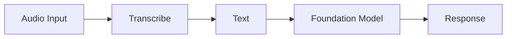

### When to Use Transcribe
- Converting audio to text before FM processing
- Call center analytics with Amazon Connect
- Meeting transcription and summarization
- Any audio-to-text step in a multi-modal pipeline

---

## 21. Amazon Augmented AI (A2I)

### What It Is
A service for adding **human review workflows** to ML/AI predictions. When the AI isn't confident enough, route to a human reviewer.

### How It's Used
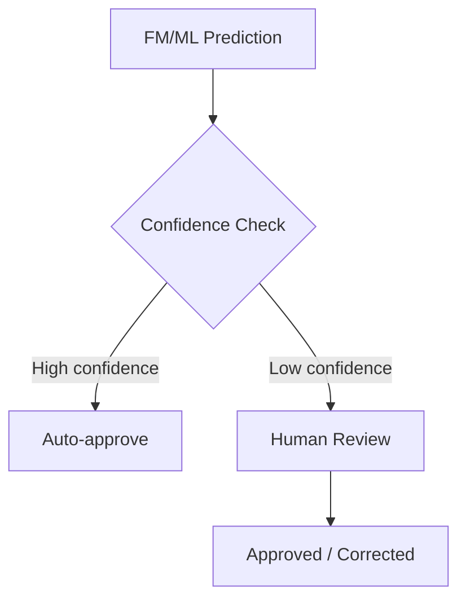

### Integration Points
- Amazon Textract (review document extraction)
- Amazon Rekognition (review content moderation)
- Any custom ML model
- Can use private workforce or Amazon Mechanical Turk

### A2I vs Human-in-the-Loop with Step Functions

| Feature | Amazon A2I | Step Functions + Manual Approval |
|---------|-----------|--------------------------------|
| **Purpose** | ML prediction review | General workflow approval |
| **Review UI** | Built-in worker portal | Custom (you build) |
| **Workforce** | Private team or Mechanical Turk | Custom (your own process) |
| **Best for** | ML-specific human review at scale | Agent decision approval, custom workflows |

### When to Use A2I
- Human review of ML predictions (Textract, Rekognition)
- When AI confidence is too low for automation
- Regulated workflows requiring human sign-off
- Continuous improvement via human feedback loop

---

## 22. Amazon Connect

### What It Is
A **cloud contact center** with built-in AI for customer service automation.

### AI/GenAI Features

| Feature | What It Does |
|---------|-------------|
| **AI agents** | Automated customer interactions with GenAI |
| **Agent assist** | Real-time guidance and knowledge for human agents |
| **Conversational IVR** | Natural language phone menus (via Lex) |
| **Contact Lens** | AI analytics: sentiment, trends, compliance |
| **Forecasting** | AI-powered staffing predictions |
| **Customer profiles** | Unified AI-powered customer intelligence |

### When to Use Connect
- Building an AI-powered contact center
- Customer service automation with chatbots (Lex integration)
- Real-time agent assist with GenAI
- Call analytics and quality monitoring

---

## Comparison Tables

### The Big Decision Tree: Which Service for What?

#### "I want to build a GenAI application"
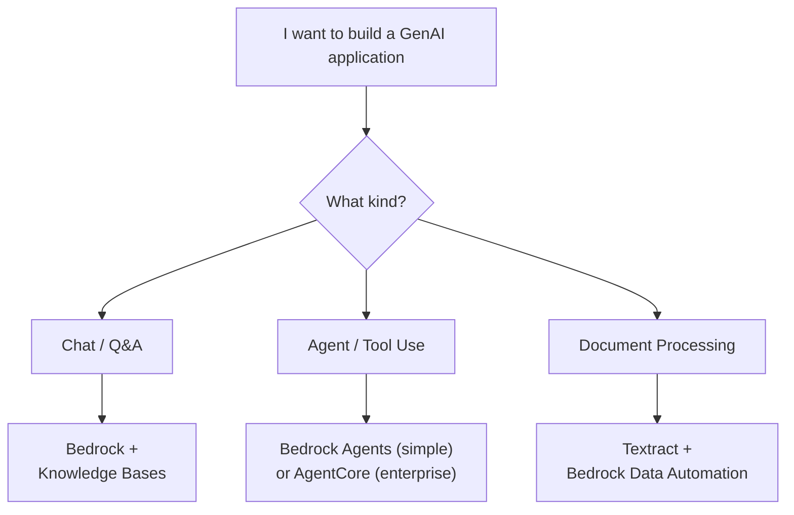

#### "I need a vector database for RAG"

| If You Need... | Use This |
|----------------|----------|
| Fully managed, zero config | Bedrock Knowledge Bases (managed vector store) |
| Large scale, hybrid search | OpenSearch Service / Serverless |
| SQL compatibility | Aurora with pgvector |
| Graph relationships | Neptune Analytics (GraphRAG) |
| Already using DynamoDB | DynamoDB for metadata + separate vector store |

#### "I need to protect user data"

| If You Need... | Use This |
|----------------|----------|
| PII in FM input/output | Bedrock Guardrails (PII policy) |
| PII in any text | Amazon Comprehend PII detection |
| PII in S3 files | Amazon Macie |
| Encryption | AWS KMS |
| Network isolation | VPC endpoints + PrivateLink |

#### "I need to evaluate my AI"

| If You Need... | Use This |
|----------------|----------|
| Compare FMs | Bedrock Model Evaluations |
| Detect bias | SageMaker Clarify |
| Monitor production model | SageMaker Model Monitor |
| Custom metrics | CloudWatch |
| Trace requests | AWS X-Ray |
| Evaluate agents | Bedrock Agent Evaluations |

#### "I need search"

| If You Need... | Use This |
|----------------|----------|
| Enterprise document search with NLU | Amazon Kendra |
| Vector + keyword hybrid search | Amazon OpenSearch Service |
| End-to-end RAG with FM | Bedrock Knowledge Bases |
| SQL search on structured data | Amazon Athena |

#### "I need a chatbot"

| If You Need... | Use This |
|----------------|----------|
| Voice + text structured chatbot | Amazon Lex |
| FM-powered dynamic assistant | Bedrock Agents |
| Enterprise knowledge assistant | Amazon Q Business |
| Contact center chatbot | Amazon Lex + Amazon Connect |
| Developer coding assistant | Amazon Q Developer |

---

### Master Comparison: All Agent/Orchestration Options

> See detailed comparison table and decision flowchart in **Section 5c** above.

| Feature | Bedrock Agents | AgentCore | Strands Agents | Agent Squad |
|---------|---------------|-----------|----------------|-------------|
| **Type** | Managed builder | Managed infra | Open-source SDK | Open-source multi-agent |
| **Code** | Low (console) | Medium (any code) | Medium (Python) | Medium (Python/TS) |
| **Models** | Bedrock only | Any model | 13+ providers | Any LLM |
| **Tools** | Action Groups (Lambda) | Gateway + MCP | @tool + MCP | Agent-as-tool |
| **Multi-agent** | Supervisor | Any pattern | Agent-as-tool | Native routing + classifier |
| **Best for** | Quick start | Production scale | Custom dev, rapid iteration | Multi-agent collaboration |
| **Production path** | Built-in | Built-in | Deploy on AgentCore | Self-managed or Lambda |

---

### Master Comparison: All Document Processing Options

| Feature | Textract | Comprehend | Bedrock Data Automation | Bedrock (Multimodal FM) |
|---------|---------|------------|------------------------|------------------------|
| **Input** | Scanned docs, images | Plain text | Docs, audio, video | Images, text, docs |
| **Output** | Structured fields, tables | Entities, sentiment, PII | Structured data | Natural language |
| **Approach** | Specialized ML | NLP models | FM-powered | General FM |
| **Best for** | Form/invoice extraction | Text analysis, PII | Multi-modal pipelines | Understanding & reasoning |

---

### Master Comparison: All Monitoring Options

| Service | Monitors What | How |
|---------|-------------|-----|
| **CloudWatch** | Metrics, logs, alarms | Dashboards, anomaly detection |
| **CloudWatch Logs** | Request/response logs | Log Insights queries |
| **X-Ray** | Request traces end-to-end | Distributed tracing map |
| **CloudTrail** | API calls (who did what) | Audit logging |
| **Cost Explorer** | AWS spending | Cost breakdowns |
| **Cost Anomaly Detection** | Unexpected spend spikes | Automatic alerts |
| **SageMaker Model Monitor** | Model drift in production | Statistical analysis |
| **Managed Grafana** | Custom dashboards | OpenSearch/CloudWatch viz |
| **Bedrock Invocation Logs** | FM request/response details | Token usage, latency |

---

## Quick-Fire: One-Line Service Summaries

| Service | One-Line Summary |
|---------|-----------------|
| **Bedrock** | Platform to access and use 100+ foundation models via API |
| **Bedrock Knowledge Bases** | Managed RAG: auto-chunk, embed, store, retrieve, generate |
| **Bedrock Guardrails** | Safety layer: content filter, PII, prompt attacks, hallucinations |
| **Bedrock Agents** | Low-code autonomous AI agent builder |
| **Bedrock AgentCore** | Enterprise infrastructure to deploy agents at scale (any framework) |
| **Strands Agents** | Open-source Python SDK for building model-driven agents with @tool + MCP |
| **Agent Squad** | Open-source framework for multi-agent orchestration with intelligent routing |
| **Bedrock Prompt Management** | Version, govern, and share prompt templates |
| **Bedrock Prompt Flows** | Visual no-code builder for multi-step prompt chains |
| **Bedrock Model Evaluation** | Compare and evaluate FMs on your data |
| **Bedrock Data Automation** | Auto-extract structured data from docs, audio, video |
| **Amazon Titan** | Amazon's own FMs (text, embeddings, images) |
| **SageMaker** | Full ML platform: train, fine-tune, deploy, monitor models |
| **Q Developer** | AI coding assistant (code gen, debug, review, security scan) |
| **Q Business** | Enterprise AI assistant for business knowledge Q&A |
| **Comprehend** | NLP: PII detection, sentiment, entities, classification |
| **Kendra** | Intelligent enterprise search with ML-powered ranking |
| **OpenSearch** | Search engine + vector database for RAG at scale |
| **Lex** | Conversational chatbot builder (voice + text) |
| **Textract** | Extract text, tables, forms from scanned documents |
| **Rekognition** | Computer vision: faces, objects, content moderation |
| **Transcribe** | Speech-to-text conversion |
| **A2I** | Human review workflows for ML predictions |
| **Connect** | AI-powered cloud contact center |
| **Macie** | Discover and protect PII in S3 |
| **Glue** | ETL, data quality, data catalog, data lineage |
