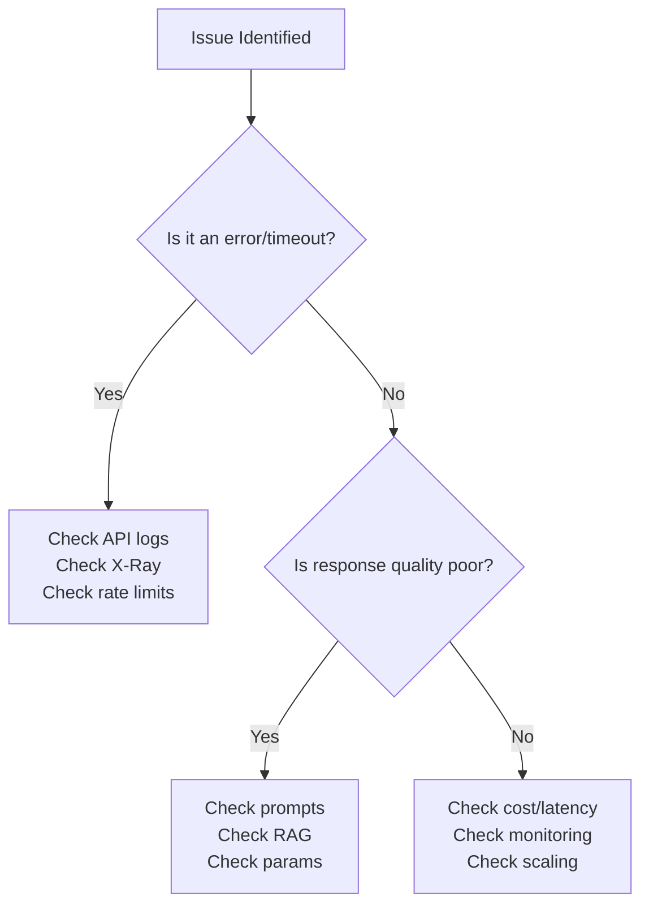

# Domain 5: Testing, Validation & Troubleshooting (11%)

> Smallest domain but don't skip it - easy points if you know the patterns.

---

## Task 5.1: Evaluation Systems for GenAI

### FM Output Quality Metrics

| Metric | What It Measures |
|--------|-----------------|
| **Relevance** | Does the response answer the question? |
| **Factual accuracy** | Are the facts correct? |
| **Consistency** | Same question = similar answers? |
| **Fluency** | Is the language natural and coherent? |
| **Helpfulness** | Does it actually help the user? |

### Model Evaluation Approaches

| Approach | Service/Tool | Description |
|----------|-------------|-------------|
| **Bedrock Model Evaluations** | Amazon Bedrock | Built-in evaluation framework |
| **A/B testing** | Bedrock Prompt Flows | Compare two models head-to-head |
| **Canary testing** | Custom | Route small % of traffic to new model |
| **LLM-as-a-Judge** | Bedrock | Use one FM to evaluate another FM's output |
| **Human feedback** | Custom interfaces | Collect ratings, annotations from users |
| **Automated quality gates** | CI/CD pipeline | Block deployment if quality drops |

### RAG Evaluation

| Metric | What to Test |
|--------|-------------|
| **Retrieval relevance** | Are the right documents retrieved? |
| **Context matching** | Does retrieved context match the query? |
| **Retrieval latency** | How fast is the search? |
| **Groundedness** | Is the response based on retrieved docs? |
| **Faithfulness** | Does the response accurately represent source? |

### Agent Evaluation

| Metric | What to Test |
|--------|-------------|
| **Task completion rate** | Does the agent finish the job? |
| **Tool usage effectiveness** | Does it pick the right tools? |
| **Reasoning quality** | Is the multi-step logic sound? |
| **Bedrock Agent evaluations** | Built-in agent assessment |

### Cost-Performance Analysis
- Token efficiency per response
- Latency-to-quality ratios
- Business outcomes measurement
- Model comparison visualizations

### Deployment Validation

| Check | Method |
|-------|--------|
| **Synthetic user workflows** | Automated test scenarios |
| **Hallucination rate** | Compare against golden datasets |
| **Semantic drift** | Detect output distribution changes |
| **Response consistency** | Same inputs produce similar outputs |
| **Regression testing** | Ensure updates don't break existing quality |

---

## Task 5.2: Troubleshooting GenAI Applications

### Common Issues & Solutions

#### 1. Context Window Overflow
**Symptoms**: Truncated responses, missing information, errors
**Solutions**:
- Dynamic chunking strategies
- Prompt design optimization (shorter prompts)
- Context pruning (remove irrelevant retrieved docs)
- Summarize long inputs before sending to FM

#### 2. API Integration Issues
**Symptoms**: Errors, timeouts, unexpected responses
**Diagnostic Tools**:
- Error logging (CloudWatch Logs)
- Request validation (check payload format)
- Response analysis (inspect error codes)
- X-Ray tracing for end-to-end visibility

#### 3. Prompt Engineering Problems
**Symptoms**: Inconsistent, irrelevant, or low-quality responses
**Solutions**:
- Prompt testing frameworks
- Version comparison (A/B test prompts)
- Systematic refinement workflow
- Template testing against edge cases

#### 4. Retrieval System Issues
**Symptoms**: Irrelevant results, slow search, missing documents

| Problem | Solution |
|---------|----------|
| Poor relevance | Check embedding quality, re-evaluate chunking |
| Embedding drift | Monitor embedding distribution over time |
| Vectorization errors | Validate input data format |
| Bad chunking | Adjust chunk size/overlap/strategy |
| Slow search | Optimize vector indices, add shards |

#### 5. Prompt Maintenance Issues
**Symptoms**: Prompts that worked before now produce poor results

| Tool | Purpose |
|------|---------|
| CloudWatch Logs | Diagnose prompt confusion patterns |
| X-Ray | Implement prompt observability pipelines |
| Schema validation | Detect format inconsistencies |
| Template testing | Regression test prompt templates |

### Troubleshooting Decision Tree

---

## Evaluation Services Quick Reference

| Service | Evaluation Capability |
|---------|----------------------|
| **Bedrock Model Evaluations** | Built-in model assessment |
| **Bedrock Agent Evaluations** | Agent performance testing |
| **Bedrock Prompt Flows** | A/B testing of prompts |
| **SageMaker Clarify** | Bias and fairness evaluation |
| **SageMaker Model Monitor** | Production model monitoring |
| **CloudWatch** | Custom metrics, alarms, dashboards |
| **X-Ray** | Distributed tracing |
| **CloudWatch Logs Insights** | Log analysis queries |

---

## Key Takeaways for Domain 5

1. **LLM-as-a-Judge**: Use one FM to evaluate another - key exam concept
2. **RAG evaluation**: Test retrieval AND generation separately
3. **Agent evaluation**: Task completion rate + tool effectiveness
4. **Context window overflow**: Most common troubleshooting scenario
5. **Golden datasets**: Use reference answers to detect hallucinations
6. **Semantic drift**: Monitor if model behavior changes over time
7. **Observability**: CloudWatch Logs Insights + X-Ray for debugging
