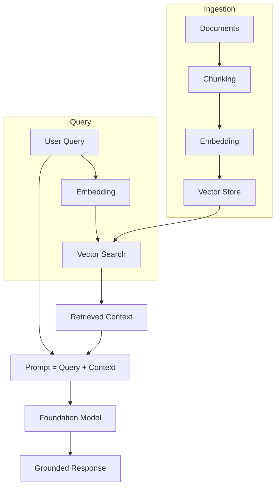
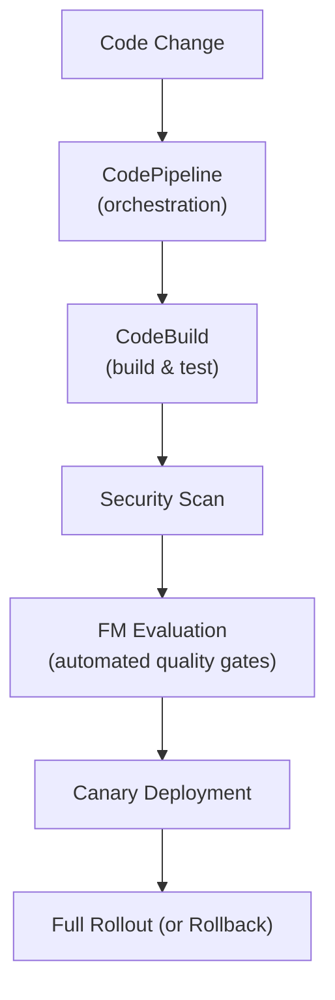

# Key Concepts & Technologies for AIP-C01

> Must-know concepts organized by topic. Study these definitions and patterns.

---

## 1. Foundation Models (FMs)

### What is a Foundation Model?
A large AI model pre-trained on broad data that can be adapted for many tasks. Examples: Claude, GPT, Amazon Titan, Llama, Cohere Command.

### Key FM Concepts

| Concept | Definition |
|---------|-----------|
| **Inference** | Running a trained model to generate predictions/responses |
| **Fine-tuning** | Additional training on domain-specific data |
| **LoRA** | Low-Rank Adaptation - efficient fine-tuning that modifies small matrices |
| **Adapters** | Lightweight modules added to a base model |
| **Model distillation** | Training a smaller model to mimic a larger one |
| **Quantization** | Reducing model precision (e.g., FP32 -> INT8) for faster inference |
| **Context window** | Maximum tokens a model can process in one request |
| **Tokens** | Units of text (roughly 4 characters = 1 token) |

### FM Parameters

| Parameter | What It Controls | Typical Range |
|-----------|-----------------|---------------|
| **Temperature** | Randomness/creativity | 0.0 (deterministic) to 1.0 (creative) |
| **Top-k** | Number of token choices considered | 1 to 500 |
| **Top-p** | Cumulative probability threshold | 0.0 to 1.0 |
| **Max tokens** | Maximum response length | Varies by model |
| **Stop sequences** | Tokens that end generation | Custom strings |

---

## 2. Retrieval Augmented Generation (RAG)

### RAG Pipeline

### Chunking Strategies

| Strategy | How It Works | Best For |
|----------|-------------|----------|
| **Fixed-size** | Split every N tokens/characters | Simple, uniform docs |
| **Semantic** | Split at meaning boundaries | Varied content |
| **Hierarchical** | Parent-child relationships | Long structured docs |
| **Sliding window** | Overlapping chunks | Preserving context |

### Embedding
- Converting text/images to dense numerical vectors
- Similar meanings = vectors close together in space
- Amazon Titan Embeddings is AWS's native embedding model
- Dimensionality matters: higher = more precise but more expensive

### Vector Search Types

| Type | How It Works |
|------|-------------|
| **Semantic search** | Find vectors closest to query vector |
| **Keyword search** | Traditional text matching |
| **Hybrid search** | Combine semantic + keyword with custom scoring |
| **Reranking** | Re-order initial results using a reranker model |

---

## 3. Agentic AI

### What is an AI Agent?
An autonomous system that uses an FM to reason, plan, and take actions using tools.

### Agent Patterns

| Pattern | Description |
|---------|------------|
| **ReAct** | Reason-Act loop: think, act, observe, repeat |
| **Plan-and-Execute** | Create plan first, then execute steps |
| **Chain-of-Thought** | Step-by-step reasoning in prompts |
| **Multi-agent** | Multiple specialized agents collaborating |
| **Human-in-the-loop** | Agent pauses for human approval |

### Model Context Protocol (MCP)
- Open standard for connecting AI agents to tools/data
- **MCP Server**: Exposes tools (Lambda for lightweight, ECS for complex)
- **MCP Client**: Agent-side library that consumes tools
- Standardized function definitions

### Tool Calling / Function Calling
- FM generates structured output requesting a tool execution
- System executes the tool and returns results to FM
- FM incorporates results into final response

---

## 4. Prompt Engineering

### Prompt Techniques

| Technique | Description | When to Use |
|-----------|------------|-------------|
| **Zero-shot** | No examples, just instructions | Simple tasks |
| **Few-shot** | Include examples in prompt | Pattern matching tasks |
| **Chain-of-thought** | "Think step by step" | Complex reasoning |
| **System prompts** | Set role and behavior rules | All applications |
| **Structured output** | Request JSON/XML format | Data extraction |
| **Prompt chaining** | Output of one prompt feeds next | Multi-step workflows |

### Prompt Management
- **Versioning**: Track prompt changes over time
- **Parameterized templates**: Reusable prompts with variables
- **A/B testing**: Compare prompt effectiveness
- **Governance**: Approval workflows, audit trails

---

## 5. Safety & Responsible AI

### Content Safety Concepts

| Concept | Definition |
|---------|-----------|
| **Prompt injection** | Malicious input that overrides system instructions |
| **Jailbreak** | Attempt to bypass model safety guardrails |
| **Hallucination** | Model generates plausible but false information |
| **Toxicity** | Harmful, offensive, or inappropriate content |
| **Bias** | Unfair treatment of demographic groups |
| **PII** | Personally Identifiable Information |
| **Groundedness** | How well response is supported by source data |
| **Faithfulness** | Accuracy of response relative to retrieved context |

### Responsible AI Principles
1. **Fairness** - No demographic bias in outputs
2. **Transparency** - Explain how AI reaches conclusions
3. **Accountability** - Track decisions, maintain audit trails
4. **Safety** - Prevent harmful outputs
5. **Privacy** - Protect user data

---

## 6. Architecture Patterns

### Resilience Patterns

| Pattern | Implementation |
|---------|---------------|
| **Circuit breaker** | Step Functions stops calling failing service |
| **Fallback** | Route to backup model when primary fails |
| **Cross-region** | Bedrock Cross-Region Inference |
| **Graceful degradation** | Reduce functionality rather than fail completely |
| **Exponential backoff** | AWS SDK automatic retry with increasing delays |

### Integration Patterns

| Pattern | Service | Use Case |
|---------|---------|----------|
| **Synchronous API** | API Gateway + Lambda | Request-response |
| **Async queue** | SQS + Lambda | Batch processing |
| **Event-driven** | EventBridge | Loose coupling |
| **Streaming** | Bedrock Streaming API | Real-time chat |
| **WebSocket** | API Gateway WebSocket | Bidirectional real-time |

### Deployment Patterns

| Pattern | Description |
|---------|------------|
| **Blue-green** | Two identical environments, switch traffic |
| **Canary** | Route small % to new version |
| **A/B testing** | Compare versions with different user groups |
| **Model cascading** | Try cheap model first, escalate if needed |

---

## 7. Cost & Performance

### Cost Optimization Strategies
1. **Right-size your model** - Don't use large FM for simple tasks
2. **Cache aggressively** - Semantic caching, prompt caching
3. **Batch when possible** - Group non-urgent requests
4. **Compress prompts** - Fewer tokens = lower cost
5. **Use provisioned throughput** for predictable high traffic
6. **Model distillation** - Create smaller, cheaper models
7. **Intelligent routing** - Route by complexity

### Performance Metrics

| Metric | What It Means |
|--------|--------------|
| **Time to First Token (TTFT)** | Latency before streaming starts |
| **Tokens per Second (TPS)** | Generation speed |
| **Total latency** | End-to-end response time |
| **Throughput** | Requests handled per second |

---

## 8. AWS Well-Architected Framework - GenAI Lens

### Six Pillars Applied to GenAI
1. **Operational Excellence** - Monitor FM performance, automate deployments
2. **Security** - Guardrails, PII protection, least privilege
3. **Reliability** - Cross-region, circuit breakers, fallbacks
4. **Performance Efficiency** - Right model, caching, streaming
5. **Cost Optimization** - Token efficiency, model cascading, caching
6. **Sustainability** - Efficient model selection, batch processing

---

## 9. CI/CD for GenAI

### Pipeline Components

---

## 10. Evaluation & Testing

### Evaluation Methods

| Method | Description |
|--------|------------|
| **LLM-as-a-Judge** | Use an FM to evaluate another FM's output |
| **Human evaluation** | Subject matter experts rate outputs |
| **Automated metrics** | BLEU, ROUGE, BERTScore for text quality |
| **Golden datasets** | Reference answers for regression testing |
| **A/B testing** | Compare models/prompts with real users |
| **Canary testing** | Test new model with small traffic % |

### What to Evaluate
- **Model quality**: Accuracy, relevance, fluency, consistency
- **RAG quality**: Retrieval precision, recall, groundedness
- **Agent quality**: Task completion, tool usage, reasoning
- **Safety**: Toxicity rate, PII leakage, bias
- **Performance**: Latency, throughput, cost per query
