# AWS Step Functions & Infrastructure Services for GenAI

> The "glue" services that connect everything. Step Functions, Lambda, API Gateway, DynamoDB, S3, EventBridge, CloudWatch, X-Ray, and more.

---

## TABLE OF CONTENTS

1. [AWS Step Functions (Deep Dive)](#1-aws-step-functions---the-genai-orchestrator)
2. [AWS Lambda](#2-aws-lambda---serverless-compute-backbone)
3. [Amazon API Gateway](#3-amazon-api-gateway---the-front-door)
4. [Amazon DynamoDB](#4-amazon-dynamodb---state--session-store)
5. [Amazon S3](#5-amazon-s3---the-data-foundation)
6. [Amazon EventBridge](#6-amazon-eventbridge---event-driven-glue)
7. [Amazon CloudWatch](#7-amazon-cloudwatch---observability-hub)
8. [AWS X-Ray](#8-aws-x-ray---distributed-tracing)
9. [AWS CloudTrail](#9-aws-cloudtrail---audit-logging)
10. [Amazon SQS & SNS](#10-amazon-sqs--sns---messaging)
11. [CI/CD Services](#11-cicd---codepipeline-codebuild-codedeploy)
12. [Security Services](#12-security-services)
13. [Networking Services](#13-networking-services)
14. [Container Services](#14-container-services)
15. [Cost Management](#15-cost-management-services)
16. [Infrastructure as Code](#16-infrastructure-as-code)
17. [How They All Fit Together](#17-how-they-all-fit-together)

---

## 1. AWS Step Functions - The GenAI Orchestrator

### What It Is
A **serverless workflow orchestration service** with a visual drag-and-drop designer. It coordinates multiple AWS services into workflows using a JSON-based state machine language (Amazon States Language). Integrates with **220+ AWS services** natively.

### Why It Matters for AIP-C01
Step Functions appears in **every single domain** of the exam. It's the go-to answer for orchestrating anything multi-step in GenAI.

---

### Workflow Types

| Type | Duration | Execution Model | Pricing | Best For |
|------|----------|----------------|---------|----------|
| **Standard** | Up to 1 year | Exactly-once | Per state transition | Complex, long-running agent workflows |
| **Express** | Up to 5 minutes | At-least-once | Per execution + duration | High-volume, short tasks (data processing) |

---

### State Types (Know These!)

| State | What It Does | GenAI Use Case |
|-------|-------------|----------------|
| **Task** | Execute work (call Lambda, Bedrock, etc.) | Invoke an FM, run a tool, call an API |
| **Choice** | Conditional branching (if/else) | Route based on FM response, confidence score |
| **Parallel** | Run branches simultaneously | Call multiple FMs at once, ensemble models |
| **Map** | Iterate over a list in parallel | Process batch of documents through FM |
| **Wait** | Pause for a duration or timestamp | Rate limiting, delay between FM calls |
| **Pass** | Transform data, pass through | Reshape FM input/output between steps |
| **Succeed** | Mark workflow as succeeded | End of happy path |
| **Fail** | Mark workflow as failed | End of error path |

---

### Error Handling

| Feature | What It Does | Example |
|---------|-------------|---------|
| **Retry** | Automatically retry failed states | Retry FM call on throttling (429) |
| **Catch** | Redirect to error handler on failure | Fall back to different model on error |
| **Timeout** | Fail if state takes too long | Kill hung FM inference |
| **Heartbeat** | Require periodic progress signal | Long-running agent tasks |

```json
{
  "Retry": [{
    "ErrorEquals": ["ThrottlingException"],
    "IntervalSeconds": 2,
    "MaxAttempts": 3,
    "BackoffRate": 2.0
  }],
  "Catch": [{
    "ErrorEquals": ["States.ALL"],
    "Next": "FallbackModel"
  }]
}
```

---

### GenAI Patterns with Step Functions

#### Pattern 1: Circuit Breaker
Protect your app when an FM service is degraded.

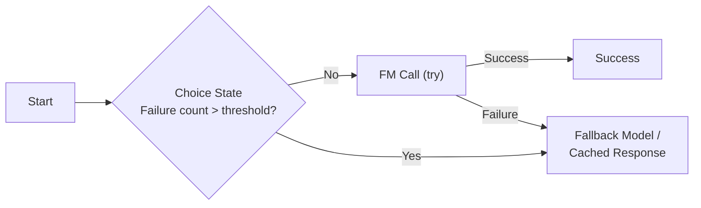

**How it works:**
1. Track failure count in DynamoDB
2. Choice state checks: failures > threshold?
3. If yes -> skip FM call, use fallback
4. If no -> try FM call with Retry + Catch
5. On success -> reset counter
6. On failure -> increment counter, use fallback

**Exam tip:** When they ask about "resilience" or "handling service disruptions" for FM calls, think Step Functions circuit breaker.

---

#### Pattern 2: ReAct Agent (Reason + Act)
FM reasons about what to do, acts, observes, repeats.

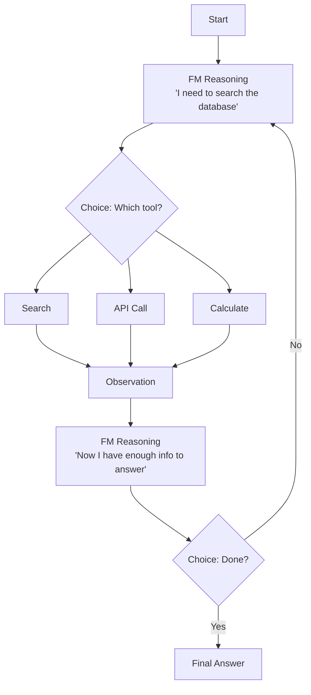

**How it works:**
1. Task state invokes FM (Bedrock) with user query + history
2. FM returns structured output: thought + action + action_input
3. Choice state routes to correct tool (Lambda functions)
4. Tool result becomes observation
5. Loop back to FM with updated context
6. FM decides when it has enough info -> final answer
7. **Stopping condition**: Max iterations via a counter + Choice state

**Exam tip:** When they ask about "agentic workflows," "autonomous reasoning," or "structured problem-solving," think Step Functions ReAct loop.

---

#### Pattern 3: Human-in-the-Loop
Agent pauses for human approval before taking critical actions.

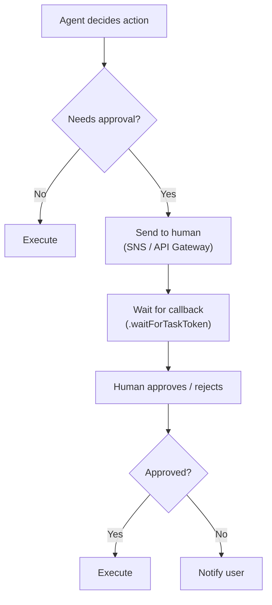

**How it works:**
1. Task state calls FM, FM decides on action
2. Choice state checks if action requires human approval
3. If yes -> generate task token, send to human (email, Slack, UI)
4. Wait state with `.waitForTaskToken` - workflow pauses (up to 1 year!)
5. Human calls `SendTaskSuccess` or `SendTaskFailure` API
6. Workflow resumes based on human decision

**Exam tip:** When they mention "human review," "approval workflows," or "controlled agent behavior," think Step Functions callback pattern.

---

#### Pattern 4: Parallel Model Ensemble
Run multiple FMs simultaneously, aggregate results.

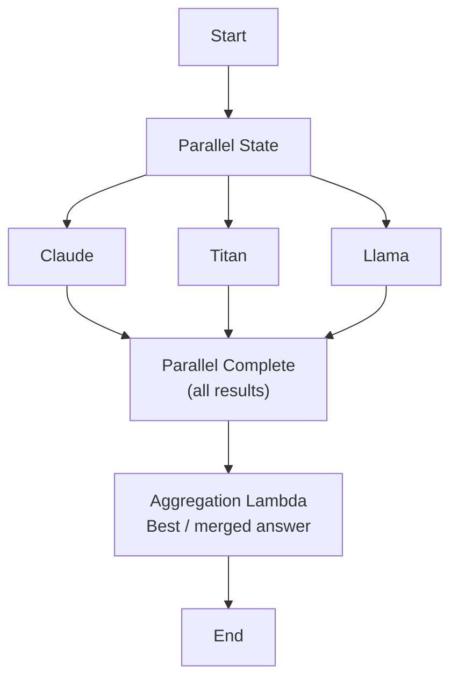

**How it works:**
1. Parallel state spawns multiple branches
2. Each branch invokes a different FM via Bedrock
3. All results collected when all branches complete
4. Lambda aggregates (voting, best score, merge)

---

#### Pattern 5: Batch Document Processing (Map State)
Process thousands of documents through an FM.

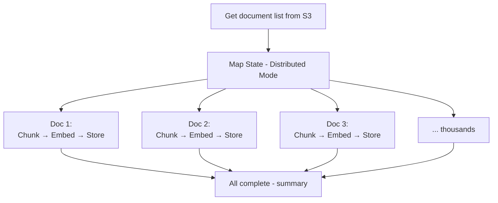

**How it works:**
1. Get list of S3 objects
2. Map state iterates over each item
3. **Distributed mode** - up to 10,000 parallel executions
4. Each iteration: read doc, chunk, embed, store in vector DB
5. Built-in concurrency controls to avoid throttling

---

#### Pattern 6: Prompt Chain (Sequential)
Output of one FM call feeds into the next.

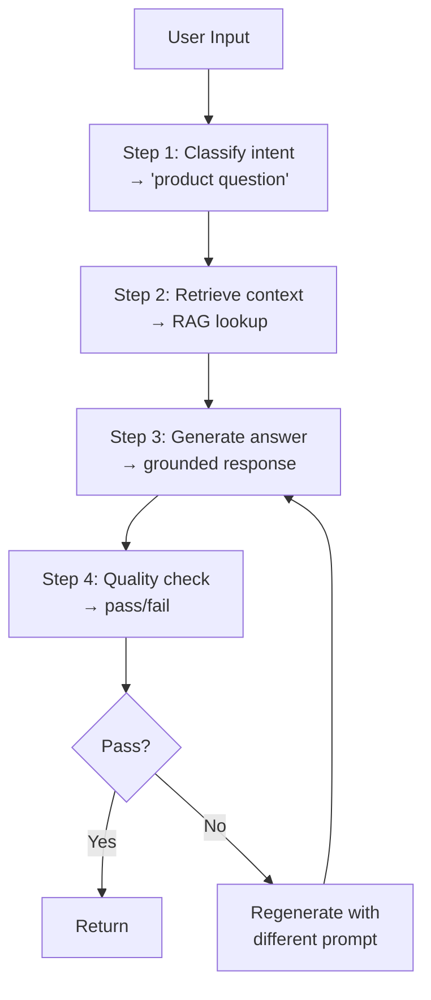

---

#### Pattern 7: A/B Testing / Canary Routing

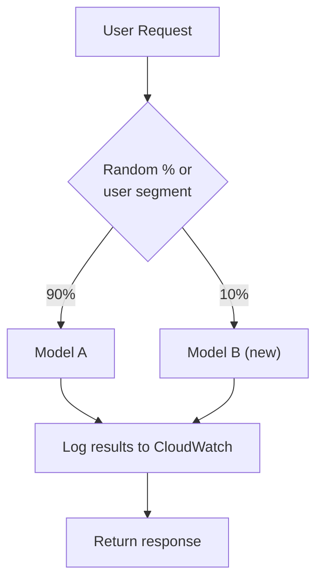

---

### Step Functions + Service Integrations for GenAI

| Integration | How | Use Case |
|------------|-----|----------|
| **Bedrock (InvokeModel)** | Native SDK integration | Call FMs directly from workflow |
| **Lambda** | Native integration | Custom logic, tools, data processing |
| **DynamoDB** | Native (GetItem, PutItem) | Read/write state, counters, session |
| **SQS** | Native (SendMessage) | Queue async FM requests |
| **SNS** | Native (Publish) | Notifications, human-in-loop alerts |
| **S3** | Native (GetObject, PutObject) | Read documents, store results |
| **EventBridge** | Native (PutEvents) | Trigger downstream workflows |
| **API Gateway** | Trigger via API | Start workflow from HTTP request |
| **CloudWatch** | Automatic | Execution metrics, logging |
| **X-Ray** | Automatic | Distributed tracing |
| **ECS/Fargate** | Native (RunTask) | Run containers for heavy processing |
| **Glue** | Native (StartJobRun) | ETL data processing |
| **CodeBuild** | Native | CI/CD integration |

---

### Step Functions Exam Cheat Sheet

| When the Question Says... | Think Step Functions Pattern... |
|--------------------------|-------------------------------|
| "Orchestrate multi-step agent workflow" | ReAct loop with Choice + Task states |
| "Circuit breaker for FM calls" | Choice state + DynamoDB failure counter |
| "Human approval before action" | Callback pattern (.waitForTaskToken) |
| "Process batch of documents" | Map state (distributed mode) |
| "Run multiple models simultaneously" | Parallel state |
| "Conditional routing based on FM output" | Choice state |
| "Chain multiple prompt steps" | Sequential Task states |
| "A/B test models" | Choice state with random routing |
| "Stop agent after N iterations" | Counter + Choice state as stopping condition |
| "Timeout if FM takes too long" | TimeoutSeconds on Task state |
| "Retry on throttling" | Retry policy with BackoffRate |
| "Fallback to different model" | Catch block -> different Task state |
| "Clarification workflow" | Wait state + callback for user input |
| "Edge case testing for prompts" | Map state over test cases |

---

## 2. AWS Lambda - Serverless Compute Backbone

### What It Is
Serverless compute that runs code in response to events. **The most referenced compute service in the entire AIP-C01 exam.**

### Key Specs

| Spec | Limit |
|------|-------|
| **Timeout** | Max 15 minutes |
| **Memory** | 128 MB to 10,240 MB (10 GB) |
| **Ephemeral storage** | Up to 10 GB (/tmp) |
| **Concurrency** | 1,000 default (can increase) |
| **Package size** | 50 MB zipped, 250 MB unzipped (or container up to 10 GB) |
| **Runtime** | Python, Node.js, Java, Go, .NET, Ruby, custom (container) |

### GenAI Use Cases for Lambda

| Use Case | How |
|----------|-----|
| **Custom chunking** | Split documents with your own logic |
| **Batch embedding** | Generate embeddings in bulk |
| **Data validation** | Validate/clean data before FM input |
| **Data normalization** | Format data for FM consumption |
| **Post-processing** | Validate/filter FM outputs |
| **Tool execution** | Agent action groups (Bedrock Agents) |
| **MCP server (lightweight)** | Stateless Model Context Protocol servers |
| **Query decomposition** | Break complex queries into sub-queries |
| **Webhook handler** | Receive events from external systems |
| **Custom guardrails** | Extra safety logic beyond Bedrock Guardrails |
| **Compliance checks** | Automated policy enforcement |

### Lambda vs ECS for GenAI

| Feature | Lambda | ECS/Fargate |
|---------|--------|------------|
| **Duration** | Max 15 min | Unlimited |
| **State** | Stateless | Stateful possible |
| **Scaling** | Instant (ms) | Slower (seconds-minutes) |
| **Cost model** | Per invocation | Per second running |
| **Best for** | Short tasks, tools, hooks | Long-running agents, complex MCP servers |
| **GPU** | No | Yes |
| **Memory** | Up to 10 GB | Up to 120 GB |
| **Exam rule** | Default choice for compute | Only when Lambda limits are exceeded |

---

## 3. Amazon API Gateway - The Front Door

### What It Is
Managed service to create, publish, and secure APIs at any scale. The entry point for users to reach your GenAI backend.

### API Types

| Type | Protocol | Best For |
|------|----------|---------|
| **REST API** | HTTP request-response | Full-featured APIs with caching, throttling, WAF |
| **HTTP API** | HTTP request-response | Simple proxy, 71% cheaper than REST |
| **WebSocket API** | Persistent bidirectional | Real-time chat, streaming FM responses |

### GenAI Use Cases

| Use Case | API Type | Details |
|----------|----------|---------|
| **FM inference endpoint** | REST/HTTP | Expose Bedrock behind an API |
| **Streaming chat** | WebSocket | Real-time token-by-token FM output |
| **Rate limiting** | REST | Protect FM from request floods |
| **Request validation** | REST | Validate payload before hitting FM |
| **Authorization** | All | IAM, Cognito, Lambda authorizer |
| **Request transformation** | REST | Reshape request for FM format |
| **Model routing** | REST | Route to different FMs based on headers/params |
| **Chunked transfer** | REST | Stream long FM responses |
| **Usage plans + API keys** | REST | Meter and limit GenAI API consumers |

### API Gateway + Step Functions
- API Gateway can **directly invoke** Step Functions (no Lambda needed)
- Start workflow from HTTP request, return execution ARN
- Poll or use callback for async results

### Exam Tip
- **WebSocket API** = real-time streaming chat with FM
- **REST API** = full control (caching, throttling, WAF, usage plans)
- **HTTP API** = simple + cheap when you just need a proxy

---

## 4. Amazon DynamoDB - State & Session Store

### What It Is
Serverless NoSQL database with single-digit millisecond latency at any scale. Key-value and document store.

### GenAI Use Cases

| Use Case | How | Key Feature Used |
|----------|-----|-----------------|
| **Conversation history** | Store chat messages per session | Key-value lookup by session ID |
| **Agent state/memory** | Persist agent context between calls | Document storage |
| **Circuit breaker counters** | Track FM failure counts | Atomic counters |
| **Semantic cache index** | Store cache keys for FM responses | Fast key-value lookup |
| **User preferences** | Store per-user FM settings | Key-value by user ID |
| **Prompt template metadata** | Track template versions and config | Document storage |
| **Rate limit tracking** | Count requests per user/time | TTL + atomic counters |
| **Vector metadata** | Store metadata alongside vector embeddings | Flexible schema |

### Key Features for GenAI

| Feature | GenAI Use |
|---------|----------|
| **TTL (Time-to-Live)** | Auto-expire cached FM responses, session data |
| **Streams** | Trigger Lambda on data changes (real-time sync) |
| **Global Tables** | Multi-region conversation state for resilience |
| **DAX (in-memory cache)** | Sub-millisecond reads for hot session data |
| **On-demand capacity** | Auto-scale for unpredictable GenAI traffic |
| **Transactions** | Atomic multi-item updates for agent state |

### DynamoDB vs ElastiCache (for Caching)

| Feature | DynamoDB + DAX | ElastiCache (Redis) |
|---------|---------------|-------------------|
| **Latency** | Single-digit ms (DAX: sub-ms) | Sub-millisecond |
| **Persistence** | Yes (durable) | Optional (primarily in-memory) |
| **Data model** | Key-value + document | Key-value + data structures |
| **Scaling** | Auto (on-demand) | Manual (add nodes) |
| **Best for** | Persistent state + fast reads | Pure caching, pub/sub, leaderboards |
| **TTL** | Yes (auto-delete) | Yes (auto-expire) |

---

## 5. Amazon S3 - The Data Foundation

### What It Is
Object storage with 99.999999999% (11 nines) durability. The default storage for everything in GenAI pipelines.

### GenAI Use Cases

| Use Case | How |
|----------|-----|
| **Document storage for RAG** | Store PDFs, docs for Knowledge Bases ingestion |
| **Training data** | Store datasets for SageMaker fine-tuning |
| **Model artifacts** | Store model weights, configs |
| **Prompt templates** | Store/version prompt template files |
| **FM output archive** | Store FM responses for audit/compliance |
| **Batch inference I/O** | Input/output bucket for Bedrock batch jobs |
| **Data lake** | Central data repository for analytics + AI |

### Key Features for GenAI

| Feature | GenAI Use |
|---------|----------|
| **Event Notifications** | Trigger Lambda/Step Functions when new doc arrives |
| **Lifecycle Policies** | Auto-tier/delete old FM logs, training data |
| **Versioning** | Track prompt template versions, model artifacts |
| **Encryption (SSE-KMS)** | Encrypt training data, FM outputs at rest |
| **Cross-Region Replication** | DR for critical AI data |
| **Intelligent-Tiering** | Auto-optimize cost for variable-access AI data |
| **S3 Vectors** (new) | Native vector storage for AI apps |
| **Object metadata** | Tag documents with source, category for RAG filtering |
| **Presigned URLs** | Secure temporary access to AI outputs |

---

## 6. Amazon EventBridge - Event-Driven Glue

### What It Is
Serverless event bus for building event-driven architectures. Routes events between AWS services, SaaS apps, and custom applications.

### GenAI Use Cases

| Use Case | How |
|----------|-----|
| **New document triggers RAG pipeline** | S3 event -> EventBridge -> Step Functions -> ingest to KB |
| **FM output triggers downstream** | FM response event -> EventBridge -> multiple targets |
| **Scheduled re-indexing** | EventBridge Scheduler -> Lambda -> refresh vector store |
| **Cross-service decoupling** | Loose coupling between AI microservices |
| **SaaS integration** | Salesforce/Jira events -> trigger AI processing |
| **Monitoring alerts** | FM error events -> EventBridge -> SNS -> PagerDuty |

### EventBridge vs SQS vs SNS

| Feature | EventBridge | SQS | SNS |
|---------|------------|-----|-----|
| **Pattern** | Event routing (many-to-many) | Message queue (point-to-point) | Pub/sub (one-to-many) |
| **Filtering** | Rich content-based rules | Limited | Message filtering |
| **Sources** | 90+ AWS + SaaS + custom | Any (send message) | Any (publish) |
| **Targets** | 20+ AWS services | Consumer pulls | Push to subscribers |
| **Ordering** | Best effort | FIFO available | Best effort |
| **Best for** | Event-driven architecture, routing | Async job queues, buffering | Fan-out notifications |
| **GenAI use** | Workflow triggers, decoupling | Buffer FM requests for async | Notify on completion |

---

## 7. Amazon CloudWatch - Observability Hub

### What It Is
The unified monitoring and observability service for AWS. Collects metrics, logs, and traces across your entire GenAI stack.

### Components

| Component | What It Does | GenAI Use |
|-----------|-------------|-----------|
| **Metrics** | Numerical time-series data | Token usage, latency, error rates |
| **Logs** | Text log storage and search | FM request/response logs |
| **Logs Insights** | SQL-like log query engine | Analyze prompt patterns, debug issues |
| **Alarms** | Alert on metric thresholds | Alert on high hallucination rate |
| **Dashboards** | Visual metric displays | GenAI ops dashboard |
| **Anomaly Detection** | ML-based unusual pattern detection | Detect token burst, response drift |
| **Synthetics** | Canary scripts to test endpoints | Proactive FM endpoint testing |
| **Custom Metrics** | Your own metrics via API | Prompt effectiveness, quality scores |
| **Contributor Insights** | Top-N analysis | Highest-cost users, most-called tools |

### GenAI Metrics to Track in CloudWatch

| Metric | What It Tells You |
|--------|------------------|
| Token input count | Cost tracking, prompt size trends |
| Token output count | Response length, cost tracking |
| Invocation latency | FM response time |
| Error rate (4xx, 5xx) | Integration health |
| Throttling count | Capacity issues |
| Hallucination rate | Quality degradation (custom metric) |
| Cache hit ratio | Caching effectiveness |
| Cost per request | Per-request economics |
| Agent task completion | Agent effectiveness |
| Tool call frequency | Tool usage patterns |

### CloudWatch + Bedrock Invocation Logs
- Enable Invocation Logging in Bedrock
- Sends full request/response to CloudWatch Logs or S3
- Query with Logs Insights for deep analysis
- Track per-model, per-user token usage

---

## 8. AWS X-Ray - Distributed Tracing

### What It Is
Distributed tracing service that follows requests as they travel through your GenAI application across multiple services.

### How It Works
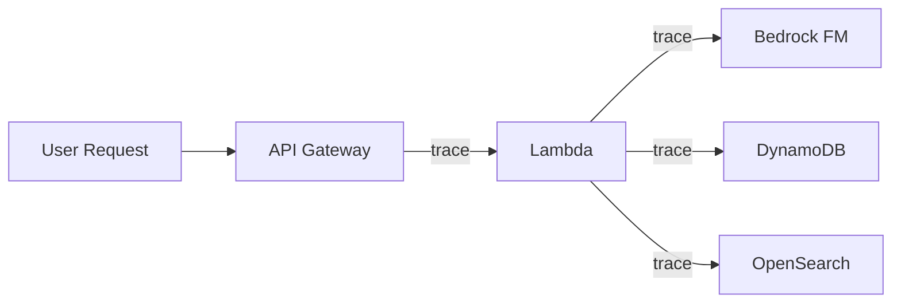

### Key Features

| Feature | GenAI Use |
|---------|----------|
| **Service Map** | Visualize your entire GenAI architecture |
| **Trace Timeline** | See exactly where latency occurs |
| **Annotations** | Tag traces with model name, prompt type |
| **Metadata** | Attach request/response data to traces |
| **Sampling** | Control trace volume (don't trace everything) |
| **Groups** | Filter traces by criteria (slow, error, model) |
| **Insights** | Auto-detect anomalies in trace data |

### GenAI Debugging with X-Ray
- Trace FM API call latency vs total request time
- Identify slow vector store queries
- Find which agent tool call is the bottleneck
- Compare latency across different FM providers
- Debug timeout issues in multi-step workflows

### X-Ray vs CloudWatch

| Feature | X-Ray | CloudWatch |
|---------|-------|------------|
| **Primary purpose** | Request tracing (where time is spent) | Metrics, logs, and alarms |
| **View** | Per-request journey across services | Aggregate system health |
| **Best for** | Debugging latency, finding bottlenecks | Monitoring trends, alerting |
| **Use together** | Yes - X-Ray for drill-down | Yes - CloudWatch for overview |

---

## 9. AWS CloudTrail - Audit Logging

### What It Is
Records **every API call** made in your AWS account. Who did what, when, from where.

### GenAI Use Cases

| Use Case | What It Records |
|----------|----------------|
| **FM access audit** | Who called which Bedrock model and when |
| **Guardrail changes** | Who modified guardrail configurations |
| **Knowledge Base access** | Who queried which data sources |
| **Prompt template changes** | Who updated prompt templates |
| **IAM changes** | Who modified AI service permissions |
| **Compliance evidence** | Complete audit trail for regulators |

### CloudTrail vs CloudWatch Logs

| Feature | CloudTrail | CloudWatch Logs |
|---------|-----------|----------------|
| **Records** | API calls (management events) | Application logs, FM request/response |
| **Purpose** | Security audit, compliance | Operational monitoring, debugging |
| **Answers** | "Who changed the guardrail?" | "What did the FM respond?" |
| **Retention** | 90 days free (or S3 forever) | Configurable |

---

## 10. Amazon SQS & SNS - Messaging

### Amazon SQS (Simple Queue Service)

| Feature | GenAI Use |
|---------|----------|
| **Standard queue** | Buffer async FM requests, decouple components |
| **FIFO queue** | Ordered processing (conversation messages) |
| **Dead letter queue** | Capture failed FM invocations for retry |
| **Visibility timeout** | Prevent duplicate FM processing |
| **Long polling** | Efficient polling for async FM results |
| **Max message size** | 256 KB (use S3 for larger FM payloads) |

**Pattern: Async FM Processing**
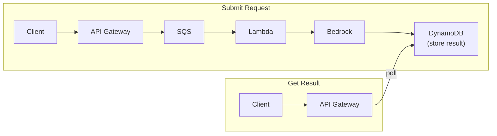

### Amazon SNS (Simple Notification Service)

| Feature | GenAI Use |
|---------|----------|
| **Fan-out** | Send FM result to multiple subscribers |
| **Push notifications** | Alert on FM completion, errors |
| **Email/SMS** | Human-in-the-loop notifications |
| **SQS subscriber** | Fan-out to multiple processing queues |
| **Lambda subscriber** | Trigger post-processing |

---

## 11. CI/CD - CodePipeline, CodeBuild, CodeDeploy

### GenAI Deployment Pipeline

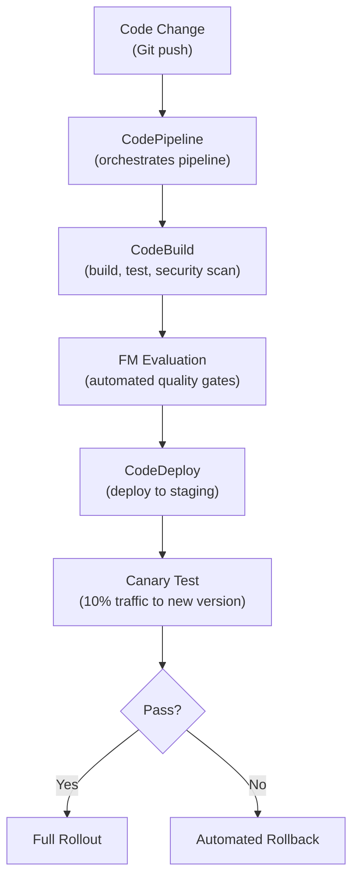

| Service | Role in GenAI CI/CD |
|---------|-------------------|
| **CodePipeline** | Orchestrate the entire deployment workflow |
| **CodeBuild** | Build app, run tests, run security scans, evaluate FM quality |
| **CodeDeploy** | Blue/green and canary deployments |
| **CodeArtifact** | Store/share packages and dependencies |

### GenAI-Specific CI/CD Steps
1. **Unit tests** for application code
2. **Integration tests** for FM API calls
3. **Security scan** for vulnerabilities (Q Developer)
4. **Prompt regression tests** against golden datasets
5. **FM quality evaluation** (Bedrock Model Evaluation)
6. **Hallucination check** against known-good answers
7. **Canary deployment** with automatic rollback
8. **Cost comparison** - new version vs baseline

---

## 12. Security Services

| Service | What It Does | GenAI Use |
|---------|-------------|-----------|
| **IAM** | Identity and access management | Control who can call Bedrock, access data |
| **IAM Identity Center** | SSO for AWS accounts | Centralized access for AI teams |
| **Amazon Cognito** | User authentication/authorization | Authenticate users of your GenAI app |
| **AWS KMS** | Encryption key management | Encrypt FM data at rest |
| **AWS Encryption SDK** | Client-side encryption | Encrypt data before sending to FM |
| **AWS Secrets Manager** | Store secrets (API keys, passwords) | Store third-party FM API keys |
| **AWS WAF** | Web application firewall | Protect GenAI API from attacks |
| **Amazon Macie** | PII discovery in S3 | Find sensitive data in training data |
| **IAM Access Analyzer** | Find overly permissive policies | Audit FM access permissions |
| **AWS Lake Formation** | Fine-grained data access | Control which data goes into RAG |

### Security Architecture for GenAI

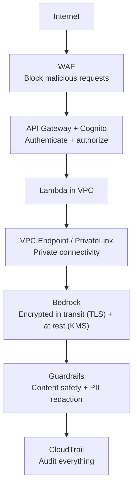

---

## 13. Networking Services

| Service | GenAI Use |
|---------|----------|
| **Amazon VPC** | Isolate GenAI workloads in private network |
| **VPC Endpoints** | Private access to Bedrock (no internet) |
| **AWS PrivateLink** | Private connectivity between services |
| **Elastic Load Balancing** | Distribute traffic across FM endpoints |
| **Amazon CloudFront** | Cache static AI responses at edge |
| **AWS Global Accelerator** | Low-latency global AI API access |
| **Amazon Route 53** | DNS + health checks for FM failover |

### Network Pattern for Secure GenAI

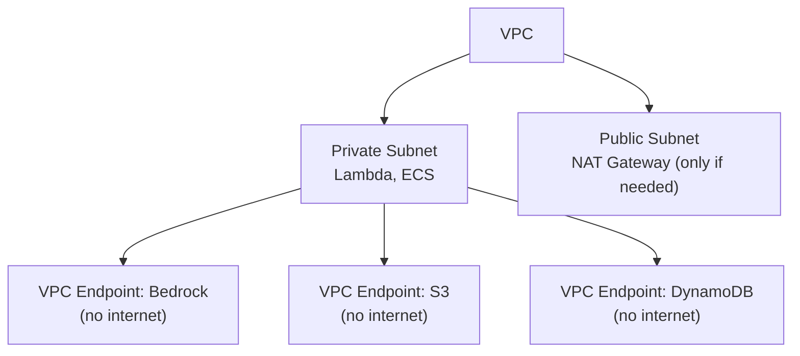

**Exam tip:** VPC endpoints = private access to Bedrock. This is THE answer for "most secure" network questions.

---

## 14. Container Services

| Service | What It Is | GenAI Use |
|---------|-----------|----------|
| **Amazon ECS** | Container orchestration | Complex MCP servers, long-running agents |
| **Amazon EKS** | Managed Kubernetes | Kubernetes-based AI workloads |
| **AWS Fargate** | Serverless containers | No server management for containers |
| **Amazon ECR** | Container registry | Store agent/tool container images |
| **AWS App Runner** | Simple container deployment | Quick deploy containerized AI apps |

### When to Use Containers vs Lambda

| Scenario | Use Lambda | Use ECS/Fargate |
|----------|-----------|----------------|
| Short tasks (< 15 min) | Yes | Overkill |
| Long-running agents | No (timeout) | Yes |
| GPU needed | No | Yes (ECS on EC2) |
| Complex MCP server | No (stateless) | Yes (stateful) |
| Simple tool/hook | Yes | Overkill |
| Custom runtime/large deps | Maybe (container) | Yes |

---

## 15. Cost Management Services

| Service | What It Does | GenAI Use |
|---------|-------------|-----------|
| **AWS Cost Explorer** | Visualize and analyze spending | Track FM costs by model, region, team |
| **AWS Cost Anomaly Detection** | Alert on unusual spending | Catch runaway FM token costs |
| **AWS Auto Scaling** | Scale resources based on demand | Scale inference endpoints |

### Cost Monitoring Architecture

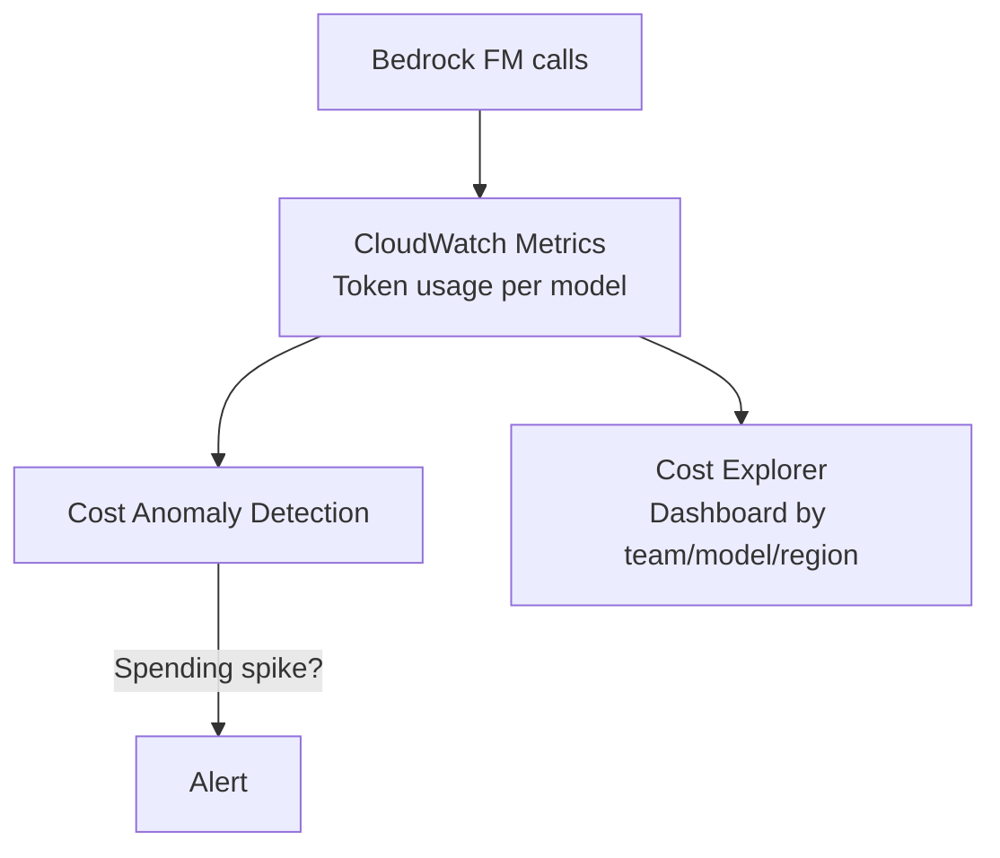

---

## 16. Infrastructure as Code

| Service | What It Does | GenAI Use |
|---------|-------------|-----------|
| **AWS CloudFormation** | JSON/YAML infrastructure templates | Deploy Bedrock resources, guardrails |
| **AWS CDK** | Code-based infrastructure (Python, TS) | Programmatic GenAI stack deployment |
| **AWS CLI** | Command-line AWS interface | Script Bedrock operations |
| **AWS SDKs** | Language-specific AWS libraries | Python boto3 for Bedrock API calls |

---

## 17. How They All Fit Together

### Complete GenAI Application Architecture

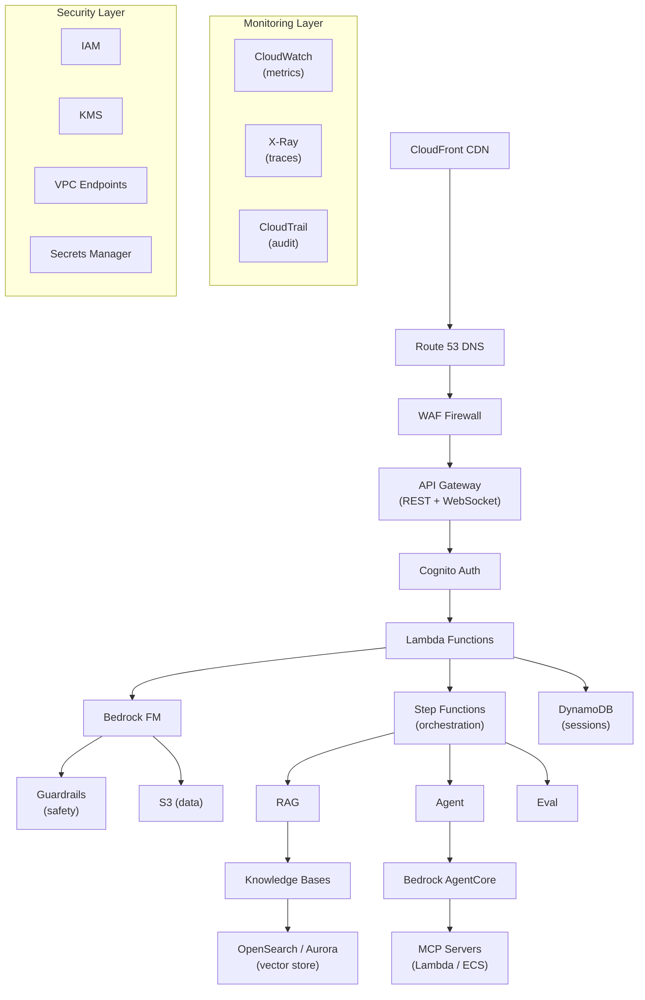

### Service Selection Flowchart

```mermaid
flowchart LR
    subgraph "Need to..."
        Q1["Orchestrate multi-step workflow?"] --> A1["Step Functions"]
        Q2["Run short compute tasks?"] --> A2["Lambda"]
        Q3["Run long/stateful tasks?"] --> A3["ECS / Fargate"]
        Q4["Expose an API?"] --> A4["API Gateway"]
        Q5["Store session/state data?"] --> A5["DynamoDB"]
        Q6["Store documents/files?"] --> A6["S3"]
        Q7["Search vectors at scale?"] --> A7["OpenSearch"]
        Q8["Route events between services?"] --> A8["EventBridge"]
        Q9["Queue async jobs?"] --> A9["SQS"]
        Q10["Send notifications?"] --> A10["SNS"]
        Q11["Monitor metrics?"] --> A11["CloudWatch"]
        Q12["Trace requests?"] --> A12["X-Ray"]
        Q13["Audit API calls?"] --> A13["CloudTrail"]
        Q14["Encrypt data?"] --> A14["KMS"]
        Q15["Authenticate users?"] --> A15["Cognito"]
        Q16["Deploy code?"] --> A16["CodePipeline + CodeBuild"]
        Q17["Define infrastructure?"] --> A17["CloudFormation / CDK"]
    end
```
