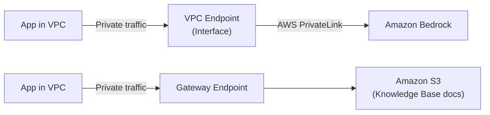
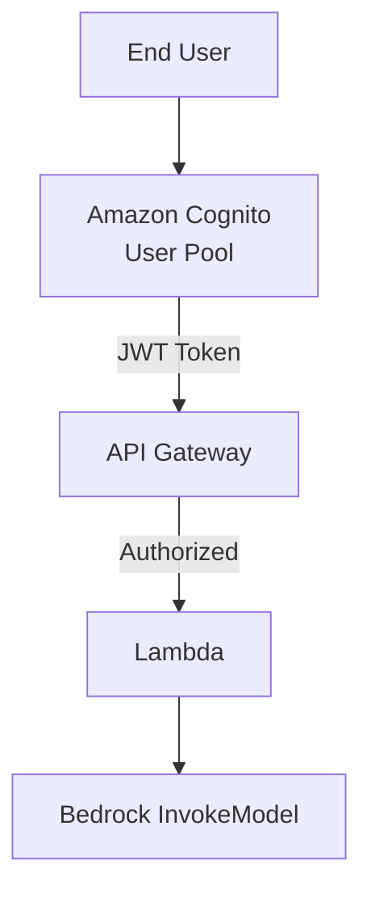
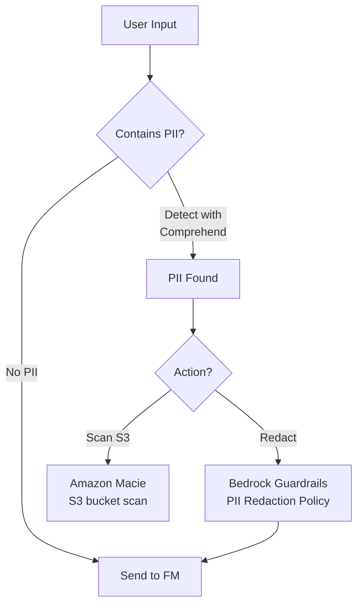
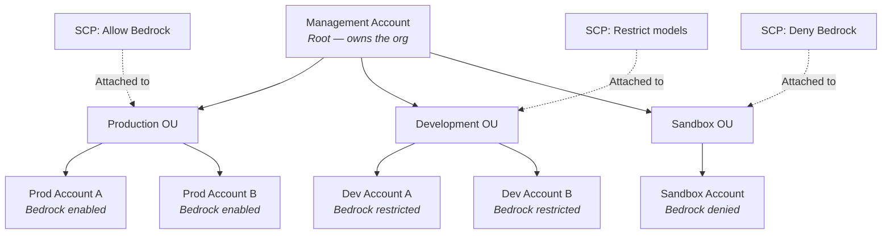
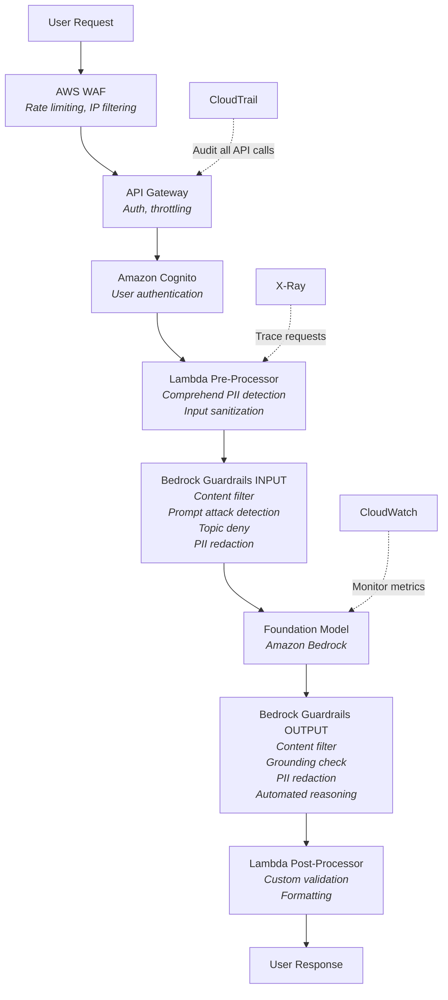
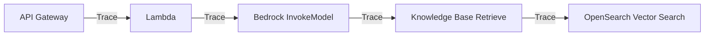
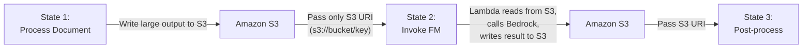
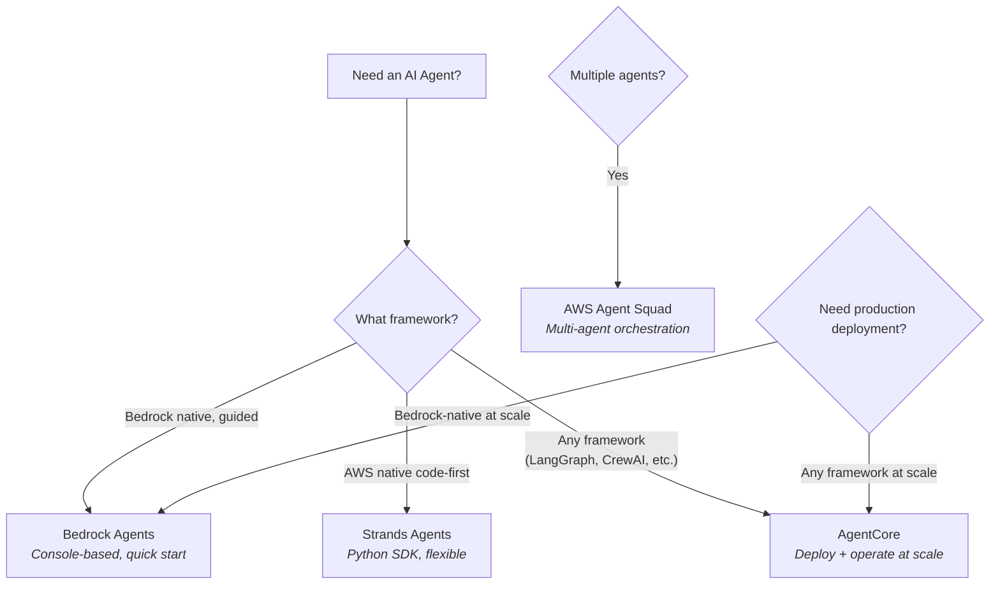

# Security, Governance & Weak Domains Deep Dive

> D3 Security (20%), D4 Ops (12%), D5 Testing (11%) are commonly challenging domains.
> D3 Security is the **highest-leverage focus area** — it's 20% of the exam.
> This guide covers the key concepts across these domains.

---

## PART 1: DOMAIN 3 — AI SAFETY, SECURITY & GOVERNANCE (20%)

---

### 1.1 IAM for GenAI — The Foundation of Everything

#### Bedrock IAM Policies — Know These Cold

```json
{
  "Version": "2012-10-17",
  "Statement": [
    {
      "Effect": "Allow",
      "Action": [
        "bedrock:InvokeModel",
        "bedrock:InvokeModelWithResponseStream"
      ],
      "Resource": "arn:aws:bedrock:us-east-1::foundation-model/anthropic.claude-*"
    }
  ]
}
```

**Key IAM actions for Bedrock:**

| Action | What It Controls |
|--------|-----------------|
| `bedrock:InvokeModel` | Synchronous model calls |
| `bedrock:InvokeModelWithResponseStream` | Streaming responses |
| `bedrock:Converse` | Multi-turn conversation API |
| `bedrock:ApplyGuardrail` | Apply guardrails to any model |
| `bedrock:CreateKnowledgeBase` | Create RAG knowledge bases |
| `bedrock:Retrieve` | Query knowledge base |
| `bedrock:RetrieveAndGenerate` | Query + generate in one call |
| `bedrock:CreateAgent` | Create Bedrock Agents |
| `bedrock:InvokeAgent` | Invoke an agent |
| `bedrock:CreateGuardrail` | Create guardrail configurations |

**Exam pattern**: "A developer needs to allow their app to invoke Claude but NOT create agents" — answer is scoping IAM actions to only `bedrock:InvokeModel*`.

#### Least Privilege Patterns

| Scenario | IAM Strategy |
|----------|-------------|
| App calls one model | Resource ARN scoped to specific model ID |
| App calls any model in a family | Wildcard: `anthropic.claude-*` |
| User can read but not create | Separate `bedrock:Get*` from `bedrock:Create*` |
| Cross-account model access | Resource-based policy + IAM role in target account |
| Restrict by region | `aws:RequestedRegion` condition key |

#### IAM Identity Center (SSO) for GenAI

| Concept | What to Know |
|---------|-------------|
| **What it is** | Centralized SSO for multi-account AWS access |
| **GenAI relevance** | Controls who can access Bedrock, SageMaker, Q Business |
| **Permission Sets** | Predefined access levels assigned to users/groups |
| **Integration** | Works with external IdPs (Okta, Azure AD, etc.) |
| **Exam angle** | "How to manage developer access to Bedrock across multiple accounts" — answer is IAM Identity Center |

#### IAM Access Analyzer

| Feature | GenAI Relevance |
|---------|----------------|
| **Policy validation** | Validates IAM policies before deployment |
| **External access findings** | Detects if Bedrock resources are exposed externally |
| **Unused access** | Finds overly broad permissions on GenAI resources |
| **Custom policy checks** | Verify policies match organizational requirements |
| **Exam angle** | "Identify if a Knowledge Base S3 bucket is publicly accessible" — IAM Access Analyzer |

---

### 1.2 Network Security for GenAI

#### VPC Endpoints for Bedrock — Deep Dive



**Two types of endpoints:**

| Type | Service | When to Use |
|------|---------|-------------|
| **Interface Endpoint** (PrivateLink) | Bedrock, SageMaker, Comprehend | API calls stay in AWS network |
| **Gateway Endpoint** | S3, DynamoDB | Free, no hourly charge |

**VPC Endpoint Policies** — you can restrict WHAT a VPC endpoint allows:

```json
{
  "Statement": [{
    "Effect": "Allow",
    "Principal": "*",
    "Action": "bedrock:InvokeModel",
    "Resource": "arn:aws:bedrock:*::foundation-model/anthropic.claude-3-*"
  }]
}
```

**Exam pattern**: "Ensure Bedrock API calls never traverse the public internet" — answer is VPC Interface Endpoint with PrivateLink.

#### Security Group Rules for GenAI

| Rule | Direction | Purpose |
|------|-----------|---------|
| Allow HTTPS (443) outbound | Egress | App to VPC endpoint |
| Allow HTTPS (443) inbound | Ingress on endpoint | Receive API traffic |
| Deny all other | Both | Principle of least privilege |

---

### 1.3 Encryption Patterns

#### AWS KMS for GenAI

| What's Encrypted | How |
|-----------------|-----|
| Bedrock model invocation data | KMS CMK (in transit: TLS 1.2+) |
| Knowledge Base vectors in OpenSearch | KMS encryption at rest |
| S3 documents for RAG | SSE-KMS or SSE-S3 |
| SageMaker training data | KMS CMK |
| DynamoDB conversation history | KMS encryption at rest |
| Bedrock custom model artifacts | KMS CMK |

**Key KMS concepts for exam:**

| Concept | Detail |
|---------|--------|
| **CMK (Customer Managed Key)** | You control rotation, policies, access |
| **AWS Managed Key** | AWS manages, less control, no cost |
| **Key Policies** | Who can use the key — separate from IAM |
| **Grant** | Temporary key access (used by Bedrock internally) |
| **Encryption context** | Key-value pairs for additional auth |

#### AWS Encryption SDK
- Client-side encryption BEFORE data reaches AWS
- **Exam angle**: "Encrypt PII before sending to Bedrock" — use Encryption SDK for client-side encryption, then Bedrock Guardrails for runtime PII filtering

---

### 1.4 Amazon Cognito for GenAI Apps



| Feature | GenAI Use Case |
|---------|---------------|
| **User Pools** | Authentication — user sign-up/sign-in |
| **Identity Pools** | Authorization — temporary AWS credentials |
| **JWT tokens** | Passed to API Gateway for auth |
| **Groups** | Different users get different model access |
| **Custom attributes** | Track user tier (free vs premium model access) |
| **Exam angle** | "Authenticate users before they access a GenAI chatbot" — Cognito User Pool + API Gateway |

**Advanced pattern:**
- Cognito Identity Pool can give users temporary STS credentials
- These credentials can be scoped to only allow `bedrock:InvokeModel`
- Different Cognito groups get different IAM roles (e.g., premium users get Claude Opus, free users get Haiku)

---

### 1.5 AWS WAF for GenAI APIs

| WAF Feature | GenAI Protection |
|-------------|-----------------|
| **Rate limiting** | Prevent abuse of expensive FM calls |
| **IP allowlisting/blocklisting** | Restrict API access by IP |
| **Request body inspection** | Detect malicious prompts at edge |
| **Custom rules** | Block requests with known attack patterns |
| **Bot control** | Prevent automated prompt attacks |
| **Integration** | Sits in front of API Gateway or CloudFront |

**Exam pattern**: "Protect a GenAI API from prompt injection attacks at the network layer" — WAF custom rules + Bedrock Guardrails (defense in depth).

---

### 1.6 AWS Secrets Manager

| Use Case | Detail |
|----------|--------|
| Store third-party API keys | OpenAI, Cohere, etc. when used alongside Bedrock |
| Lambda environment variables | Secrets Manager > env vars for sensitive config |
| Automatic rotation | Rotate API keys without app downtime |
| Bedrock Agent tools | Agent action groups may need external API keys |
| **Exam angle** | "Store and rotate API keys for an external tool used by a Bedrock Agent" — Secrets Manager |

---

### 1.7 Data Protection — PII Pipeline



**When to use which service:**

| Service | Best For | Detail |
|---------|----------|--------|
| **Amazon Comprehend** | Real-time PII detection in text | 30+ PII entity types (SSN, phone, email, etc.) |
| **Amazon Macie** | PII detection in S3 data | Scans S3 buckets, finds sensitive data patterns |
| **Bedrock Guardrails** | PII filtering in FM I/O | Real-time redaction during model interaction |
| **Data Masking (custom)** | Replace PII with tokens | Lambda function that tokenizes before FM call |

**Exam patterns:**
- "Detect PII in training data stored in S3" — **Macie**
- "Prevent PII from being sent to a foundation model" — **Bedrock Guardrails PII policy**
- "Extract PII entities from customer emails" — **Comprehend**
- "Redact PII from FM responses before showing to user" — **Bedrock Guardrails (output)**

---

### 1.8 AWS Lake Formation — Data Governance for GenAI

> **Note**: Appeared on your beta exam even though not on official in-scope list. Beta exams test potential new questions.

| Feature | GenAI Relevance |
|---------|----------------|
| **Centralized permissions** | One place to manage who accesses what data |
| **Fine-grained access** | Row-level and column-level security |
| **LF-Tags** | Tag-based access control at scale |
| **Cross-account sharing** | Share data lakes across AWS accounts securely |
| **Data Catalog integration** | Works with AWS Glue Data Catalog |
| **Audit logging** | CloudTrail integration for compliance |

**GenAI use cases:**
- Control which teams can access training data for fine-tuning
- Restrict Knowledge Base data sources by department
- Enforce column-level security (e.g., hide salary column from HR chatbot)
- Multi-account data governance for GenAI workloads

**How it fits with GenAI:**
```
Lake Formation (data access) -> Glue Data Catalog (metadata) -> S3 (raw data) -> Bedrock Knowledge Base (RAG)
```

**Exam pattern**: "A company wants to ensure that its GenAI application can only access specific columns in a data lake" — Lake Formation fine-grained access with LF-Tags.

---

### 1.9 AWS Organizations, SCPs & Control Tower — Multi-Account Governance

> **Appeared on your beta exam.** Know SCPs deeply — they are the exam's go-to for org-wide restrictions.

#### AWS Organizations — The Foundation



| Concept | What to Know |
|---------|-------------|
| **Organization** | Collection of AWS accounts managed centrally |
| **Management Account** | Root account that creates the org — SCPs do NOT apply to it |
| **Organizational Unit (OU)** | Group of accounts (e.g., Production OU, Dev OU, Sandbox OU) |
| **Service Control Policy (SCP)** | Permission boundary applied to OU or account — restricts what's POSSIBLE |
| **Consolidated Billing** | Single bill across all accounts — track GenAI costs per account |

#### How SCPs Work — Critical Exam Concept

```
Final Permission = IAM Policy ∩ SCP

If IAM says ALLOW but SCP says DENY → DENIED
If IAM says ALLOW and SCP says ALLOW → ALLOWED
If SCP doesn't mention the action → DENIED (implicit deny)
```

**SCPs are guardrails, not grants.** They set the MAXIMUM permissions possible. They don't grant permissions — IAM policies still needed.

| SCP Fact | Detail |
|----------|--------|
| **SCPs don't grant access** | They only restrict. Users still need IAM policies to actually do things |
| **SCPs are inherited** | Attach to OU → applies to ALL accounts in that OU and child OUs |
| **Management account exempt** | SCPs never apply to the management account |
| **Deny overrides everything** | An explicit Deny in SCP cannot be overridden by IAM Allow |
| **Default SCP** | `FullAWSAccess` — allows everything (you add restrictions on top) |

#### SCP Examples for GenAI — Know These Patterns

**Pattern 1: Restrict Bedrock to approved regions only**

```json
{
  "Version": "2012-10-17",
  "Statement": [
    {
      "Sid": "DenyBedrockOutsideApprovedRegions",
      "Effect": "Deny",
      "Action": "bedrock:*",
      "Resource": "*",
      "Condition": {
        "StringNotEquals": {
          "aws:RequestedRegion": ["us-east-1", "eu-west-1"]
        }
      }
    }
  ]
}
```

**Exam angle**: "Prevent any account from using Bedrock outside us-east-1 and eu-west-1" → This SCP.

**Pattern 2: Restrict to specific foundation models only**

```json
{
  "Version": "2012-10-17",
  "Statement": [
    {
      "Sid": "DenyUnapprovedModels",
      "Effect": "Deny",
      "Action": [
        "bedrock:InvokeModel",
        "bedrock:InvokeModelWithResponseStream"
      ],
      "Resource": "*",
      "Condition": {
        "StringNotLike": {
          "bedrock:ModelId": [
            "anthropic.claude-3-5-sonnet-*",
            "amazon.titan-text-express-*"
          ]
        }
      }
    }
  ]
}
```

**Exam angle**: "Only allow Claude Sonnet and Titan Text — deny all other models across the org" → This SCP.

**Pattern 3: Deny Bedrock entirely for sandbox accounts**

```json
{
  "Version": "2012-10-17",
  "Statement": [
    {
      "Sid": "DenyAllBedrock",
      "Effect": "Deny",
      "Action": "bedrock:*",
      "Resource": "*"
    }
  ]
}
```

**Exam angle**: "Block all Bedrock access in sandbox/dev accounts" → Attach this SCP to the Sandbox OU.

**Pattern 4: Deny model customization (fine-tuning) but allow inference**

```json
{
  "Version": "2012-10-17",
  "Statement": [
    {
      "Sid": "DenyModelCustomization",
      "Effect": "Deny",
      "Action": [
        "bedrock:CreateModelCustomizationJob",
        "bedrock:CreateProvisionedModelThroughput"
      ],
      "Resource": "*"
    }
  ]
}
```

**Exam angle**: "Allow developers to invoke models but prevent them from fine-tuning or provisioning throughput" → This SCP.

#### SCP vs IAM Policy vs Bedrock Guardrails — When to Use Which

| Control Type | Scope | What It Controls | Example |
|-------------|-------|-----------------|---------|
| **SCP** | Entire OU/account | Which AWS **API actions** are possible | "No one in dev can call bedrock:InvokeModel" |
| **IAM Policy** | Specific user/role | Which AWS **API actions** a principal can perform | "This Lambda role can only call bedrock:InvokeModel on Claude Sonnet" |
| **Bedrock Guardrails** | Model I/O content | What **content** the model can process/generate | "Never include PII in responses" |
| **VPC Endpoint Policy** | Network path | Which actions allowed through that **network endpoint** | "Only allow bedrock:InvokeModel through this VPC endpoint" |

**Key distinction:**
- **SCPs** = "Can this ACCOUNT use Bedrock?" (org-level boundary)
- **IAM** = "Can this USER/ROLE call this specific Bedrock action?" (identity-level permission)
- **Guardrails** = "Is this CONTENT safe/appropriate?" (content-level filtering)

They work in layers — all three can (and should) be used together.

#### AWS Control Tower — Organizations Made Easy

| Feature | What It Does |
|---------|-------------|
| **Landing Zone** | Pre-configured multi-account setup with best practices |
| **Guardrails** | Pre-built SCPs (preventive) and Config rules (detective) |
| **Account Factory** | Automated new account provisioning with templates |
| **Dashboard** | Single pane of glass for compliance across all accounts |

**Control Tower guardrail types:**

| Type | How It Works | Example |
|------|-------------|---------|
| **Preventive** | SCP — blocks the action before it happens | Deny Bedrock in non-approved regions |
| **Detective** | AWS Config rule — alerts after a violation | Alert if someone creates a public S3 bucket |
| **Proactive** | CloudFormation Hook — blocks non-compliant resources at deploy time | Block EC2 instances without encryption |

**Exam patterns:**

| "When the question says..." | Answer is... |
|------------------------------|-------------|
| "Prevent Bedrock usage in non-approved regions across ALL accounts" | SCP with `aws:RequestedRegion` condition |
| "Block specific models across the org" | SCP with `bedrock:ModelId` condition |
| "Deny all Bedrock in sandbox accounts" | SCP attached to Sandbox OU |
| "Allow inference but deny fine-tuning org-wide" | SCP denying `bedrock:CreateModelCustomizationJob` |
| "Set up multi-account governance from scratch" | AWS Control Tower Landing Zone |
| "Detect non-compliant resources after deployment" | Control Tower detective guardrail (Config rule) |
| "Centralized billing for GenAI costs per team" | AWS Organizations consolidated billing + per-account tracking |
| "Management account not affected by restriction" | Correct — SCPs don't apply to management account |

---

### 1.10 Amazon MemoryDB — Vector Search for Real-Time GenAI

> **Note**: Appeared on your exam. Know it as a vector store option.

| Feature | Detail |
|---------|--------|
| **What it is** | Redis-compatible in-memory database with vector search |
| **Vector search** | HNSW indexing, cosine/euclidean/dot product distance |
| **Performance** | Single-digit ms latency (p99), highest recall on AWS |
| **Durability** | Multi-AZ with transaction log |
| **Use cases** | Real-time RAG, semantic caching, fraud detection, recommendations |

**When to choose MemoryDB over other vector stores:**

| Vector Store | Best For |
|-------------|----------|
| **OpenSearch Service** | Full-text + vector hybrid search, complex queries |
| **Aurora pgvector** | When you already use PostgreSQL, transactional data |
| **Neptune** | Graph-based RAG (GraphRAG), relationship queries |
| **MemoryDB** | Ultra-low latency real-time search, semantic caching |
| **Bedrock Knowledge Bases** | Managed RAG (auto-handles vector store) |

**Exam pattern**: "A real-time trading application needs the fastest possible vector search with durability" — MemoryDB.

---

### 1.11 Bedrock Guardrails — Master Every Policy

You need to know ALL 6 policies at implementation detail level:

#### Policy 1: Content Moderation

| Setting | Detail |
|---------|--------|
| **Categories** | Hate, Insults, Sexual, Violence, Misconduct, Prompt Attack |
| **Strength levels** | NONE, LOW, MEDIUM, HIGH |
| **Applies to** | Input AND output separately configurable |
| **Image support** | Yes — filters harmful images too |

#### Policy 2: Prompt Attack Detection

| Feature | Detail |
|---------|--------|
| **What it detects** | Prompt injection, jailbreaks |
| **Input filter** | Blocks malicious prompts before reaching model |
| **Detection method** | ML-based classifier |
| **Exam angle** | "Users are manipulating the chatbot to ignore instructions" — enable Prompt Attack filter |

#### Policy 3: Topic Classification (Denied Topics)

| Feature | Detail |
|---------|--------|
| **What it does** | Blocks entire topics you define |
| **Example** | "Do not discuss competitor products" |
| **Configuration** | Natural language topic definitions |
| **Exam angle** | "Ensure the FM never gives investment advice" — Denied Topic policy |

#### Policy 4: PII Redaction (Sensitive Information Filters)

| Feature | Detail |
|---------|--------|
| **Actions** | BLOCK or ANONYMIZE |
| **Entity types** | Name, SSN, phone, email, credit card, etc. |
| **Regex patterns** | Custom patterns for domain-specific PII |
| **Applies to** | Input AND output |

#### Policy 5: Contextual Grounding Check

| Feature | Detail |
|---------|--------|
| **What it does** | Validates FM response against source documents |
| **Grounding threshold** | 0-1 score; responses below threshold are blocked |
| **Relevance threshold** | Ensures response is relevant to the query |
| **Exam angle** | "Reduce hallucinations in a RAG application" — Contextual Grounding policy |

#### Policy 6: Automated Reasoning

| Feature | Detail |
|---------|--------|
| **What it does** | Mathematical/logical verification of claims |
| **Accuracy** | 99%+ for supported checks |
| **Use case** | Policy compliance, numerical accuracy |
| **Exam angle** | "Verify that the FM's insurance policy answers are mathematically correct" — Automated Reasoning |

#### ApplyGuardrail API — Cross-Model Protection

```python
# Apply guardrails to ANY model (not just Bedrock)
response = bedrock_client.apply_guardrail(
    guardrailIdentifier='my-guardrail-id',
    guardrailVersion='1',
    source='INPUT',  # or 'OUTPUT'
    content=[{'text': {'text': user_input}}]
)
```

**This works with**: Bedrock models, SageMaker models, self-hosted models, OpenAI, any third-party model.

---

### 1.12 Defense-in-Depth Architecture — Complete Pattern



**Exam loves this pattern**. Know every layer and what service goes where.

---

### 1.13 Governance & Compliance Framework

#### SageMaker Model Cards — Documentation

| Field | Purpose |
|-------|---------|
| **Model details** | Name, version, type, framework |
| **Intended use** | What the model should/shouldn't be used for |
| **Training details** | Data sources, preprocessing, training parameters |
| **Evaluation results** | Metrics, bias analysis, performance benchmarks |
| **Ethical considerations** | Known limitations, risks, fairness analysis |

**Exam angle**: "Document the limitations and intended use of a fine-tuned model" — SageMaker Model Cards.

#### Data Lineage with AWS Glue

| Feature | Purpose |
|---------|---------|
| **Glue Data Catalog** | Central metadata repository |
| **Automatic lineage** | Tracks data transformations |
| **Data quality rules** | Validate data before it enters RAG pipeline |
| **Crawlers** | Auto-discover data schemas |

**Pipeline**: Raw data in S3 -> Glue Crawler -> Data Catalog -> Glue ETL -> Processed data -> Knowledge Base

#### Audit Trail

| Service | What It Logs |
|---------|-------------|
| **CloudTrail** | Every AWS API call (who did what, when) |
| **CloudWatch Logs** | Application logs, FM request/response logs |
| **Bedrock Invocation Logs** | Detailed model invocation data |
| **S3 access logs** | Who accessed training data |

---

## PART 2: DOMAIN 4 — OPERATIONAL EFFICIENCY (12%)

---

### 2.1 Cost Optimization — Bedrock Pricing Models

| Pricing Model | Best For | Detail |
|--------------|----------|--------|
| **On-Demand** | Variable workloads | Pay per token, no commitment |
| **Batch Inference** | Non-real-time | Up to 50% cheaper, asynchronous |
| **Provisioned Throughput** | Predictable high-volume | Reserved capacity, consistent performance |
| **Cross-Region Inference** | High availability | Routes to available capacity across regions |

#### Intelligent Prompt Routing

| Feature | Detail |
|---------|--------|
| **What it does** | Routes queries to appropriate model based on complexity |
| **Cost savings** | Up to 30% reduction |
| **How it works** | Simple queries go to smaller/cheaper model, complex to larger |
| **Exam angle** | "Reduce costs while maintaining quality" — Intelligent Prompt Routing |

#### Model Distillation

| Feature | Detail |
|---------|--------|
| **What it does** | Transfer knowledge from large model to smaller one |
| **Performance** | Up to 500% faster inference |
| **Cost** | Up to 75% cheaper |
| **How** | Large "teacher" model generates training data for small "student" model |
| **Exam angle** | "Deploy a faster, cheaper model that maintains quality of a larger model" — Model Distillation |

#### Prompt Caching

| Feature | Detail |
|---------|--------|
| **What it does** | Caches common prompt prefixes |
| **Savings** | Up to 90% on cached portion of prompt |
| **Use case** | System prompts, repeated context, few-shot examples |
| **How it works** | First request caches; subsequent requests hit cache |
| **Exam angle** | "Reduce costs when many requests share the same system prompt" — Prompt Caching |

### 2.2 Monitoring — What to Set Up

#### CloudWatch Metrics for GenAI

| Metric | Alarm Threshold | Why |
|--------|----------------|-----|
| `Invocations` | Spike detection | Abuse or runaway automation |
| `ModelLatency` | > 10s | Performance degradation |
| `InputTokenCount` | > budget | Cost overrun |
| `OutputTokenCount` | > budget | Cost overrun |
| `ThrottledCount` | > 0 | Hitting limits |
| `InvocationClientErrors` (4xx) | > threshold | Client-side issues |
| `InvocationServerErrors` (5xx) | > threshold | Service issues |

#### Bedrock Model Invocation Logging

**Must enable explicitly** — not on by default!

| Setting | Options |
|---------|---------|
| **Destination** | CloudWatch Logs or S3 |
| **What's logged** | Full request, response, metadata, token counts |
| **Image logging** | Optional — can log image inputs/outputs |
| **Embedding logging** | Optional — can log embedding vectors |

**Exam angle**: "A compliance team needs to review all FM interactions" — Enable Bedrock Model Invocation Logging to S3.

#### AWS X-Ray for GenAI Tracing



- End-to-end visibility of a GenAI request
- Identify bottlenecks (is it the FM? The retrieval? The Lambda?)
- Service map visualization
- **Exam angle**: "Identify why a RAG application has high latency" — X-Ray trace analysis

#### CloudWatch Synthetics (Canaries)

| Feature | Detail |
|---------|--------|
| **What it does** | Automated synthetic testing of endpoints |
| **GenAI use** | Periodically test GenAI API health and response quality |
| **Scripting** | Node.js or Python scripts that call your API |
| **Alerts** | CloudWatch alarms on failures |
| **Exam angle** | "Proactively detect if GenAI API quality degrades" — CloudWatch Synthetics |

### 2.3 Performance Optimization Patterns

#### Streaming vs Synchronous

| Approach | Use Case | API |
|----------|----------|-----|
| **Synchronous** | Background processing, batch | `InvokeModel` |
| **Streaming** | User-facing chat, real-time | `InvokeModelWithResponseStream` |
| **Converse Streaming** | Multi-turn with streaming | `ConverseStream` |

**Always stream for user-facing apps** — reduces Time to First Token (TTFT).

#### Key Performance Metrics

| Metric | Definition | Optimize By |
|--------|-----------|-------------|
| **TTFT** | Time to First Token | Streaming, smaller models, caching |
| **ITL** | Inter-Token Latency | Provisioned throughput |
| **TPS** | Tokens Per Second | Batching, provisioned throughput |
| **E2E Latency** | Total request time | All of the above + retrieval optimization |

---

## PART 3: DOMAIN 5 — TESTING, VALIDATION & TROUBLESHOOTING (11%)

---

### 3.1 Bedrock Model Evaluations — Built-In

| Evaluation Type | What It Tests |
|----------------|--------------|
| **Automatic** | Uses metrics (ROUGE, BERTScore, etc.) against reference answers |
| **Human** | Human evaluators rate model outputs |
| **LLM-as-a-Judge** | One FM evaluates another FM's output |

#### LLM-as-a-Judge — Exam Favorite

| Aspect | Detail |
|--------|--------|
| **What it is** | Use a capable FM to score another FM's outputs |
| **Metrics evaluated** | Helpfulness, correctness, harmlessness, coherence |
| **How** | Define evaluation criteria in natural language |
| **Advantage** | Scales better than human evaluation |
| **Limitation** | Judge model may have its own biases |
| **Exam angle** | "Automatically evaluate response quality at scale" — LLM-as-a-Judge |

#### Bedrock Agent Evaluations

| Metric | What It Tests |
|--------|--------------|
| **Task completion** | Did the agent finish the job? |
| **Tool selection** | Did it pick the right tools? |
| **Reasoning** | Was the multi-step logic sound? |
| **Efficiency** | How many steps did it take? |

### 3.2 RAG Evaluation — Know These Metrics

| Metric | What It Measures | How to Fix if Bad |
|--------|-----------------|-------------------|
| **Retrieval Relevance** | Are the right docs retrieved? | Improve embeddings, chunking |
| **Context Precision** | What % of retrieved context is useful? | Better chunk size, reranking |
| **Faithfulness** | Does response match source docs? | Grounding check, lower temperature |
| **Answer Relevance** | Does the answer address the question? | Better prompts, query rewriting |
| **Groundedness** | Is the response based on evidence? | Contextual Grounding guardrail |

### 3.3 Testing Patterns

#### A/B Testing with Bedrock

| Step | How |
|------|-----|
| 1. Define variants | Model A vs Model B, or Prompt A vs Prompt B |
| 2. Route traffic | Bedrock Prompt Flows or custom Lambda router |
| 3. Collect metrics | CloudWatch custom metrics per variant |
| 4. Analyze | Statistical significance testing |
| 5. Deploy winner | Update production configuration |

#### Canary Testing for GenAI

| Step | Detail |
|------|--------|
| 1. Deploy new model/prompt | To a small % of traffic (5-10%) |
| 2. Monitor quality | Golden dataset checks, latency, error rates |
| 3. Compare to baseline | Automated comparison against production |
| 4. Gradual rollout | Increase % if quality is maintained |
| 5. Rollback | Automatic if quality degrades |

#### Golden Datasets for Hallucination Detection

| Component | Purpose |
|-----------|---------|
| **Reference answers** | Known-correct answers for test questions |
| **Automated comparison** | Compare FM output against reference |
| **Scoring** | Semantic similarity + exact match |
| **Drift detection** | Run periodically to detect quality changes |
| **Exam angle** | "Detect when a model starts hallucinating more than before" — Golden dataset comparison over time |

### 3.4 Troubleshooting — Decision Tree

| Symptom | First Check | Solution |
|---------|-------------|----------|
| **Truncated responses** | Context window overflow | Reduce input size, dynamic chunking |
| **Wrong/irrelevant answers** | Prompt quality, RAG retrieval | Improve prompt, check embeddings |
| **Hallucinations** | Lack of grounding | Enable Grounding guardrail, use RAG |
| **High latency** | Model size, retrieval time | X-Ray trace, switch to smaller model |
| **Inconsistent outputs** | Temperature too high | Lower temperature, fix random seed |
| **Rate limiting errors** | Throughput limits | Provisioned throughput, retry with backoff |
| **PII in responses** | No PII filtering | Enable Guardrails PII policy |
| **Injection attacks working** | No input filtering | Enable Prompt Attack guardrail + WAF |
| **Cost spike** | Token explosion | Check CloudWatch token metrics, add limits |
| **Agent stuck in loop** | Poor tool definitions | Improve tool descriptions, add max iterations |

### 3.5 Prompt Troubleshooting Specifics

| Problem | Diagnostic Tool | Fix |
|---------|----------------|-----|
| **Prompt confusion** | CloudWatch Logs — analyze request/response | Simplify prompt structure |
| **Format inconsistency** | Schema validation | Add JSON Schema constraint |
| **Template regression** | Compare old vs new prompt output | Version control prompts |
| **Observability gaps** | X-Ray trace analysis | Add instrumentation |

---

## PART 4: EXAM STRATEGY

---

### Key Numbers

| Fact | Detail |
|------|--------|
| **Total questions** | 65 scored + 10-20 unscored (beta had 85 total) |
| **Passing score** | 750/1000 |
| **Time** | 180 minutes |
| **Question types** | Multiple choice, multiple response, scenario-based |

### High-Impact Domains

| Domain | Weight | Priority |
|--------|--------|----------|
| D3: Security | 20% | **HIGH** — biggest bang for study time |
| D4: Ops Efficiency | 12% | MEDIUM — know monitoring and cost patterns |
| D5: Testing | 11% | MEDIUM — know evaluation frameworks |

### Exam Day Tips

1. **Flag and return** — Don't spend 5 min on one question. Flag it and come back.
2. **Eliminate wrong answers** — Usually 2 of 4 options are clearly wrong.
3. **"Most" appropriate** — Multiple answers may be correct; pick the BEST one.
4. **Read the LAST sentence** — The actual question is often at the end of a long scenario.
5. **Look for AWS-native** — When in doubt, pick the AWS-managed service over custom solutions.
6. **Defense in depth** — Security questions often want MULTIPLE layers, not just one.
7. **Least privilege** — IAM questions almost always want the most restrictive option that still works.

### Services to Master

| Priority | Service | Why |
|----------|---------|-----|
| 1 | Bedrock Guardrails (all 6 policies) | Appears in D3 heavily |
| 2 | IAM + IAM Identity Center | Access control is foundational |
| 3 | CloudWatch + X-Ray | Monitoring appears in D4 and D5 |
| 4 | VPC Endpoints + PrivateLink | Network security pattern |
| 5 | Cognito + WAF + API Gateway | Auth + API protection pattern |
| 6 | SageMaker Model Cards | Governance documentation |
| 7 | Glue Data Catalog + Lineage | Data governance |
| 8 | KMS + Encryption SDK | Encryption patterns |
| 9 | Comprehend + Macie | PII detection pipeline |
| 10 | MemoryDB | Vector store option for real-time |

---

## PART 5: QUICK RECALL CHEAT SHEET

### Security Service Mapping

| "When the question says..." | Answer is... |
|------------------------------|-------------|
| "Prevent harmful content" | Bedrock Guardrails — Content Moderation |
| "Block prompt injection" | Bedrock Guardrails — Prompt Attack Detection |
| "Never discuss topic X" | Bedrock Guardrails — Denied Topics |
| "Protect PII in FM I/O" | Bedrock Guardrails — PII Redaction |
| "Reduce hallucinations" | Bedrock Guardrails — Contextual Grounding OR Knowledge Bases |
| "Verify mathematical claims" | Bedrock Guardrails — Automated Reasoning |
| "Apply safety to non-Bedrock model" | ApplyGuardrail API |
| "Detect PII in S3" | Amazon Macie |
| "Detect PII in text" | Amazon Comprehend |
| "Private network to Bedrock" | VPC Endpoint + PrivateLink |
| "Encrypt model data" | AWS KMS |
| "Encrypt before sending to AWS" | AWS Encryption SDK |
| "Authenticate chatbot users" | Amazon Cognito |
| "Rate limit API" | AWS WAF or API Gateway throttling |
| "Audit who called Bedrock" | CloudTrail |
| "Log FM interactions" | Bedrock Model Invocation Logging |
| "Multi-account access control" | IAM Identity Center |
| "Analyze IAM policies for issues" | IAM Access Analyzer |
| "Manage secrets/API keys" | AWS Secrets Manager |
| "Granular data lake access" | AWS Lake Formation |
| "Multi-account governance" | AWS Control Tower + SCPs |
| "Fastest vector search" | Amazon MemoryDB |
| "Document model limitations" | SageMaker Model Cards |
| "Track data lineage" | AWS Glue |

### Cost Optimization Mapping

| "When the question says..." | Answer is... |
|------------------------------|-------------|
| "Reduce token costs" | Prompt compression, context pruning |
| "Route simple queries cheaply" | Intelligent Prompt Routing |
| "Make a smaller, faster model" | Model Distillation |
| "Cache repeated prompts" | Prompt Caching |
| "Predictable high throughput" | Provisioned Throughput |
| "Cheapest for batch processing" | Batch Inference |
| "Detect cost anomalies" | AWS Cost Anomaly Detection |
| "Track spending" | AWS Cost Explorer |

### Testing & Troubleshooting Mapping

| "When the question says..." | Answer is... |
|------------------------------|-------------|
| "Evaluate model quality at scale" | LLM-as-a-Judge |
| "Compare two models" | A/B testing with Bedrock Prompt Flows |
| "Gradual model rollout" | Canary testing |
| "Detect hallucination drift" | Golden datasets over time |
| "Debug high latency" | X-Ray distributed tracing |
| "Monitor token usage" | CloudWatch metrics |
| "Test RAG quality" | Retrieval relevance + faithfulness metrics |
| "Test agent performance" | Bedrock Agent Evaluations |
| "Proactive API health checks" | CloudWatch Synthetics |
| "Analyze FM request/response logs" | Bedrock Invocation Logging + CloudWatch Logs Insights |
| "Deploy agents from any framework at scale" | Amazon Bedrock AgentCore |
| "Agent persistent memory across sessions" | AgentCore Memory |
| "Enforce real-time policy on agent tools" | AgentCore Policy Engine (Cedar) |
| "Agent needs to browse websites safely" | AgentCore Secure Browser |
| "Convert APIs into agent tools" | AgentCore Gateway |
| "Quick guided agent building" | Bedrock Agents (not AgentCore) |
| "Step Functions output too large" | Store in S3, pass S3 URI between states |
| "Multi-agent orchestration" | Strands Agents + AWS Agent Squad |
| "Agent-tool protocol" | Model Context Protocol (MCP) |
| "Automated data processing for AI" | Amazon Bedrock Data Automation |
| "Circuit breaker for FM calls" | Step Functions circuit breaker pattern |
| "Break complex problem into steps" | Step Functions ReAct pattern |

---

## PART 6: STEP FUNCTIONS FOR GENAI — CRITICAL PATTERNS

---

### 6.1 The 256 KB Payload Limit

**Step Functions hard limit**: Each state's input/output payload is capped at **256 KB**. This CANNOT be increased.

In GenAI workflows (large documents, FM responses, RAG context), you WILL hit this.

#### The Solution: S3 as Intermediary



**The pattern:**
1. Lambda writes large data to **S3**
2. Returns only the **S3 object reference** (bucket + key) as state output — tiny payload
3. Next state's Lambda **reads from S3** using that reference
4. Repeat for each state

| Scenario | Wrong Answer | Right Answer |
|----------|-------------|-------------|
| "Step Functions output exceeds 256 KB" | Increase the limit | **Store in S3, pass S3 URI** |
| "Large FM response in Step Functions" | Pass full response to next state | **Lambda writes to S3, passes key** |
| "Document processing exceeds payload" | Use Express Workflows (same limit) | **S3 as intermediary** |
| "Compress the payload" | Viable workaround | **Not reliable** — doesn't guarantee < 256 KB |

### 6.2 Step Functions GenAI Patterns

| Pattern | How It Works | Exam Relevance |
|---------|-------------|----------------|
| **Circuit Breaker** | Detect FM failures, stop retrying after threshold, fall back to alternative | Skill 1.2.3 — resilient AI systems |
| **ReAct (Reason+Act)** | Step Functions orchestrates think-act-observe loops for agents | Skill 2.1.2 — structured reasoning |
| **Human-in-the-Loop** | Step Functions pauses workflow, waits for human approval via callback | Skill 2.1.5 — human review |
| **Prompt Chaining** | Sequential states each call a different prompt/model | Skill 2.5.5 — prompt chaining |
| **A/B Testing** | Parallel states test two models, Choice state picks winner | Skill 5.1.2 — model evaluation |
| **Dynamic Routing** | Choice state routes to different models based on input | Skill 2.4.4 — model routing |

### 6.3 Step Functions + Bedrock Integration

```json
{
  "Type": "Task",
  "Resource": "arn:aws:states:::bedrock:invokeModel",
  "Parameters": {
    "ModelId": "anthropic.claude-3-sonnet-20240229-v1:0",
    "Body": {
      "messages": [{ "role": "user", "content.$": "$.prompt" }]
    }
  }
}
```

Step Functions has **direct Bedrock integration** — you can call `bedrock:invokeModel` as a Task state without needing a Lambda function in between. This reduces latency and cost.

---

## PART 7: NEW SERVICES & CONCEPTS FROM OFFICIAL EXAM GUIDE

> These appeared in the official AIP-C01 exam guide but were missing from previous study materials.

---

### 7.1 Strands Agents & AWS Agent Squad

| Service | What It Is | Exam Relevance |
|---------|-----------|----------------|
| **Strands Agents** | AWS-native agent framework for building autonomous AI agents | D2 — Skill 2.1.1, 2.1.6 |
| **AWS Agent Squad** | Multi-agent orchestration system for coordinating multiple AI agents | D2 — Skill 2.1.1 |

**Key concepts:**
- Multi-agent systems where specialized agents collaborate
- Strands API for implementing custom agent behaviors
- Agent Squad coordinates routing between specialized agents

### 7.2 Model Context Protocol (MCP)

| Feature | Detail |
|---------|--------|
| **What it is** | Standardized protocol for FM-tool interactions |
| **Stateless MCP servers** | Lambda functions — lightweight tool access |
| **Stateful MCP servers** | Amazon ECS — complex tools requiring state |
| **MCP clients** | Libraries that agents use to call MCP servers |
| **Exam angle** | "Standardize how agents access external tools" — MCP |

### 7.3 Amazon Bedrock Data Automation

| Feature | Detail |
|---------|--------|
| **What it is** | Automated data processing for AI workflows |
| **Use case** | ETL-style data transformation optimized for GenAI |
| **Exam angle** | "Automate data processing in GenAI pipelines" — Bedrock Data Automation |

### 7.4 Bedrock APIs — Know All of Them

| API | Purpose | When to Use |
|-----|---------|-------------|
| **InvokeModel** | Synchronous single call | Background processing |
| **InvokeModelWithResponseStream** | Streaming response | User-facing chat |
| **Converse** | Multi-turn conversation | Chatbots with history |
| **ConverseStream** | Multi-turn + streaming | Real-time chat UX |
| **Responses API** | OpenAI-compatible endpoint | Migration from OpenAI |
| **ApplyGuardrail** | Apply guardrails to any model | Cross-model safety |
| **Retrieve** | Query Knowledge Base | Custom RAG control |
| **RetrieveAndGenerate** | Query + generate in one call | Simple RAG |

### 7.5 Key Fine-Tuning Concepts

| Concept | Detail |
|---------|--------|
| **LoRA (Low-Rank Adaptation)** | Parameter-efficient fine-tuning — modifies small subset of weights |
| **Adapters** | Small trainable modules added to frozen model |
| **SageMaker Model Registry** | Version and manage fine-tuned models |
| **Rollback strategies** | Revert to previous model version if new one degrades |

### 7.6 Missing Infrastructure Patterns

| Pattern | Services | Exam Relevance |
|---------|----------|----------------|
| **Graceful degradation** | Step Functions + fallback FM | When primary model is unavailable |
| **Cross-Region model deployment** | Bedrock Cross-Region Inference | High availability |
| **Edge deployment** | AWS Wavelength | Low-latency AI at edge |
| **On-premises integration** | AWS Outposts | Data residency requirements |
| **GraphQL for GenAI** | AWS AppSync | Real-time subscriptions for chat |
| **WebSockets for streaming** | API Gateway WebSocket API | Real-time FM streaming to browsers |

### 7.7 Amazon Bedrock AgentCore — Deploy Agents at Scale

> **On the official in-scope list.** Know the difference between Bedrock Agents vs AgentCore.

#### What Is It?

Enterprise-grade platform for deploying and operating AI agents at scale — **any framework, any model, no infrastructure management**.

#### AgentCore Services — 3 Categories

| Category | Service | What It Does |
|----------|---------|-------------|
| **Build** | **Memory** | Persistent context across sessions; episodic memory (agents learn from past interactions) |
| **Build** | **Gateway** | Transforms APIs/Lambda into agent-compatible tools; connects to MCP servers; semantic tool discovery |
| **Build** | **Secure Browser** | Sandboxed web browsing for agents (navigate sites, fill forms safely) |
| **Build** | **Code Interpreter** | Secure code execution for data analysis, visualizations, computations |
| **Build** | **Policy Engine** | Natural language → Cedar policies; intercepts tool calls in real-time to enforce boundaries |
| **Deploy** | **Serverless Runtime** | Deploy agents with session isolation; supports workloads from real-time chat to 8-hour async tasks |
| **Deploy** | **Identity** | Integrates with existing IdPs; agents securely access AWS + third-party services |
| **Deploy** | **VPC + PrivateLink** | Enterprise network security for deployed agents |
| **Monitor** | **Observability** | CloudWatch dashboards, OpenTelemetry, token/latency/error tracking |
| **Monitor** | **Evaluations** | Continuous quality scoring: correctness, helpfulness, safety, goal success rate |

#### Bedrock Agents vs AgentCore — When to Use Which

| Feature | Bedrock Agents | AgentCore |
|---------|---------------|-----------|
| **Builder experience** | Guided, console-based | Code-first, any framework |
| **Framework** | Bedrock-native only | Any: CrewAI, LangGraph, LlamaIndex, Strands, custom |
| **Model support** | Bedrock models | Any model (Bedrock, OpenAI, self-hosted, etc.) |
| **Target user** | Quick start, low-code | Production engineers at scale |
| **Infrastructure** | Fully managed by Bedrock | Fully managed by AgentCore (serverless) |
| **Session duration** | Short conversations | Up to 8-hour async tasks |
| **Policy control** | Guardrails | Cedar-based Policy Engine (intercepts tool calls) |
| **Memory** | Basic conversation history | Persistent memory with episodic learning |

#### Exam Patterns

| "When the question says..." | Answer is... |
|------------------------------|-------------|
| "Deploy agents from any framework at scale" | **AgentCore** |
| "Quick guided agent building with Bedrock console" | **Bedrock Agents** |
| "Agent needs persistent memory across sessions" | **AgentCore Memory** |
| "Convert existing APIs into agent tools" | **AgentCore Gateway** |
| "Enforce real-time policy on agent tool calls" | **AgentCore Policy Engine (Cedar)** |
| "Agent needs to browse web pages safely" | **AgentCore Secure Browser** |
| "Agent needs to run code/generate charts" | **AgentCore Code Interpreter** |
| "Monitor agent quality in production" | **AgentCore Evaluations** |
| "Build agent, no framework preference, just Bedrock" | **Bedrock Agents** |

#### The Agent Landscape — Complete Picture



**Common pattern**: Build with **Strands Agents** → Deploy with **AgentCore** → Orchestrate with **Agent Squad**

---

## PART 8: COMPLETE IN-SCOPE AWS SERVICES LIST

> Official from [AWS Exam Guide](https://docs.aws.amazon.com/aws-certification/latest/ai-professional-01/aip-01-in-scope-services.html). Know what each does.

### Analytics
Amazon Athena, Amazon EMR, AWS Glue, Amazon Kinesis, Amazon OpenSearch Service, Amazon QuickSight, Amazon MSK

### Application Integration
Amazon AppFlow, AWS AppConfig, Amazon EventBridge, Amazon SNS, Amazon SQS, AWS Step Functions

### Compute
AWS App Runner, Amazon EC2, AWS Lambda, Lambda@Edge, AWS Outposts, AWS Wavelength

### Containers
Amazon ECR, Amazon ECS, Amazon EKS, AWS Fargate

### Customer Engagement
Amazon Connect

### Database
Amazon Aurora, Amazon DocumentDB, Amazon DynamoDB, DynamoDB Streams, Amazon ElastiCache, Amazon Neptune, Amazon RDS

### Developer Tools
AWS Amplify, AWS CDK, AWS CLI, AWS CloudFormation, AWS CodeArtifact, AWS CodeBuild, AWS CodeDeploy, AWS CodePipeline, AWS Tools and SDKs, AWS X-Ray

### Machine Learning (PRIMARY FOCUS)
Amazon Augmented AI (A2I), Amazon Bedrock, Bedrock AgentCore, Bedrock Knowledge Bases, Bedrock Prompt Management, Bedrock Prompt Flows, Amazon Comprehend, Amazon Kendra, Amazon Lex, Amazon Q Business, Q Business Apps, Amazon Q Developer, Amazon Rekognition, Amazon SageMaker AI, SageMaker Clarify, SageMaker Data Wrangler, SageMaker Ground Truth, SageMaker JumpStart, SageMaker Model Monitor, SageMaker Model Registry, SageMaker Neo, SageMaker Processing, SageMaker Unified Studio, Amazon Textract, Amazon Titan, Amazon Transcribe

### Management and Governance
AWS Auto Scaling, AWS Chatbot, AWS CloudTrail, Amazon CloudWatch, CloudWatch Logs, CloudWatch Synthetics, AWS Cost Anomaly Detection, AWS Cost Explorer, Amazon Managed Grafana, AWS Service Catalog, AWS Systems Manager, AWS Well-Architected Tool

### Migration and Transfer
AWS DataSync, AWS Transfer Family

### Networking and Content Delivery
Amazon API Gateway, AWS AppSync, Amazon CloudFront, Elastic Load Balancing, AWS Global Accelerator, AWS PrivateLink, Amazon Route 53, Amazon VPC

### Security, Identity, and Compliance
Amazon Cognito, AWS Encryption SDK, IAM, IAM Access Analyzer, IAM Identity Center, AWS KMS, Amazon Macie, AWS Secrets Manager, AWS WAF

### Storage
Amazon EBS, Amazon EFS, Amazon S3, S3 Intelligent-Tiering, S3 Lifecycle policies, S3 Cross-Region Replication

### NOT In-Scope but Appeared on Beta Exam
Amazon MemoryDB, AWS Lake Formation, AWS Control Tower — these are **not on the official in-scope list** but appeared on the beta exam (possibly as unscored pilot questions). Know the basics just in case.
